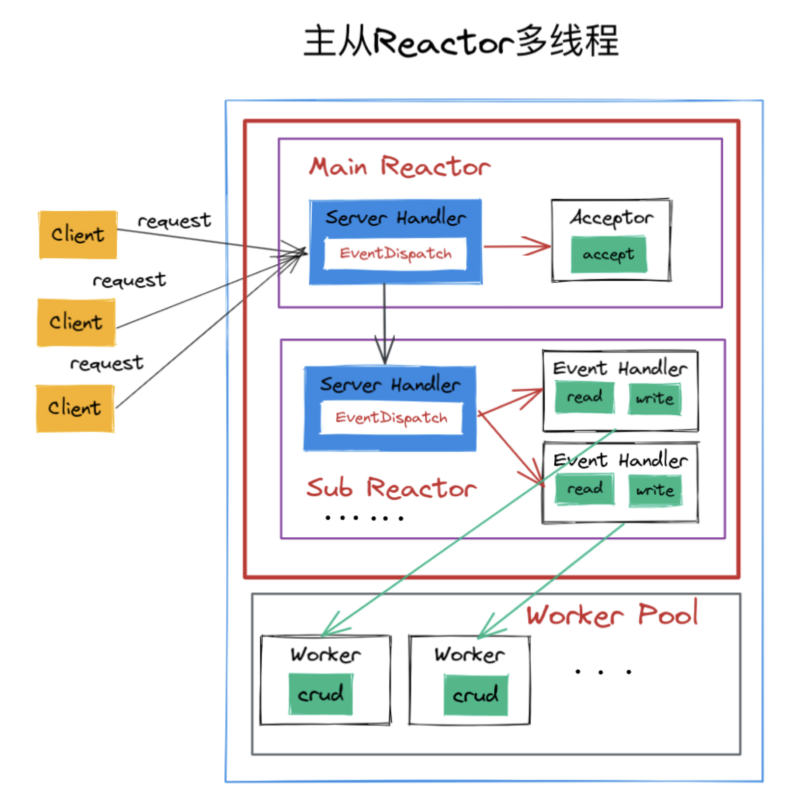

Kafka 服务端 BrokerServer 的请求处理模型为主从 Reactor 多线程模型，本文以 [v3.3](https://github.com/apache/kafka/tree/3.3) 具体分析一下 kafka-core 的 Scala 源码如何实现这个模型，以应对海量的并发请求。



### [BrokerServer#startup()](https://sourcegraph.com/github.com/apache/kafka@3.3/-/blob/core/src/main/scala/kafka/server/BrokerServer.scala?L180)

Kafka Broker 启动入口在 class BrokerServer, 会根据 KafkaConfig 

1. 创建 SocketServer, 调用其 enableRequestProcessing 监听配置的端口处理请求，请求分为两类：data plane request, control plane request
2. 创建 dataPlaneRequestHandlerPool 独立的线程池处理请求

```scala
/**
 * A Kafka broker that runs in KRaft (Kafka Raft) mode.
 */
class BrokerServer(...) extends KafkaBroker {

	def replicaManager: ReplicaManager = _replicaManager

	override def startup(): Unit = {
		// ...
		// Create and start the socket server acceptor threads so that the bound port is known.
    // Delay starting processors until the end of the initialization sequence to ensure
    // that credentials have been loaded before processing authentications.
    socketServer = new SocketServer(config, metrics, time, credentialProvider, apiVersionManager)
		// ...
		// Enable inbound TCP connections. Each endpoint will be started only once its matching
    // authorizer future is completed.
    socketServer.enableRequestProcessing(authorizerFutures)

		// ...
		// Create the request processor objects.
      val raftSupport = RaftSupport(forwardingManager, metadataCache)
      dataPlaneRequestProcessor = new KafkaApis(
        requestChannel = socketServer.dataPlaneRequestChannel,
        metadataSupport = raftSupport,
        replicaManager = replicaManager,
        groupCoordinator = groupCoordinator,
        txnCoordinator = transactionCoordinator,
        autoTopicCreationManager = autoTopicCreationManager,
        brokerId = config.nodeId,
        config = config,
        configRepository = metadataCache,
        metadataCache = metadataCache,
        metrics = metrics,
        authorizer = authorizer,
        quotas = quotaManagers,
        fetchManager = fetchManager,
        brokerTopicStats = brokerTopicStats,
        clusterId = clusterId,
        time = time,
        tokenManager = tokenManager,
        apiVersionManager = apiVersionManager)

      dataPlaneRequestHandlerPool = new KafkaRequestHandlerPool(config.nodeId,
        socketServer.dataPlaneRequestChannel, dataPlaneRequestProcessor, time,
        config.numIoThreads, s"${DataPlaneAcceptor.MetricPrefix}RequestHandlerAvgIdlePercent",
        DataPlaneAcceptor.ThreadPrefix)
	}
}

trait KafkaBroker extends KafkaMetricsGroup {

  def dataPlaneRequestHandlerPool: KafkaRequestHandlerPool
}
```

### [SocketServer#enableRequestProcessing()](https://sourcegraph.com/github.com/apache/kafka@3.3/-/blob/core/src/main/scala/kafka/network/SocketServer.scala?L193)

Kafka 的 data plane 支持监听多个端口，每个端口即一个 EndPoint

1. 每个 EndPoint 对应一个 DataPlaneAcceptor 用于接收客户端请求创建连接
2. DataPlaneAcceptor 对应多个 Processor, acceptor 将连接均匀地分配给 processors 处理连接的读写 I/O
3. 读取到一个完整请求后将请求通过 dataPlaneRequestChannel 传递给 KafkaApis 独立的线程处理
4. 处理完成产生响应，再由 Processor 将响应报文写回请求连接

除了 data plane, 还有 control plane acceptor  用于处理控制面请求，其只对应一个 processor

```scala
/**
 * Handles new connections, requests and responses to and from broker.
 * Kafka supports two types of request planes :
 *  - data-plane :
 *    - Handles requests from clients and other brokers in the cluster.
 *    - The threading model is
 *      1 Acceptor thread per listener, that handles new connections.
 *      It is possible to configure multiple data-planes by specifying multiple "," separated endpoints for "listeners" in KafkaConfig.
 *      Acceptor has N Processor threads that each have their own selector and read requests from sockets
 *      M Handler threads that handle requests and produce responses back to the processor threads for writing.
 *  - control-plane :
 *    - Handles requests from controller. This is optional and can be configured by specifying "control.plane.listener.name".
 *      If not configured, the controller requests are handled by the data-plane.
 *    - The threading model is
 *      1 Acceptor thread that handles new connections
 *      Acceptor has 1 Processor thread that has its own selector and read requests from the socket.
 *      1 Handler thread that handles requests and produces responses back to the processor thread for writing.
 */
class SocketServer(...) {
	// data-plane
  private[network] val dataPlaneAcceptors = new ConcurrentHashMap[EndPoint, DataPlaneAcceptor]()
  val dataPlaneRequestChannel = new RequestChannel(maxQueuedRequests, DataPlaneAcceptor.MetricPrefix, time, apiVersionManager.newRequestMetrics)
  // control-plane
  private[network] var controlPlaneAcceptorOpt: Option[ControlPlaneAcceptor] = None
  val controlPlaneRequestChannelOpt: Option[RequestChannel] = config.controlPlaneListenerName.map(_ =>
    new RequestChannel(20, ControlPlaneAcceptor.MetricPrefix, time, apiVersionManager.newRequestMetrics))

	/**
   * A future which is completed once all the authorizer futures are complete.
   */
  private val allAuthorizerFuturesComplete = new CompletableFuture[Void]

	// ...

def enableRequestProcessing(authorizerFutures: Map[Endpoint, CompletableFuture[Void]]): Unit = this.synchronized {
		// ...
    def chainAcceptorFuture(acceptor: Acceptor): Unit = {
      // Because of ephemeral ports, we need to **match acceptors to futures by looking at**
      // **the listener name**, rather than the endpoint object.
      authorizerFutures.find {
        case (endpoint, _) => acceptor.endPoint.listenerName.value().equals(endpoint.listenerName().get())
      } match {
				// **acceptor.startFuture() calls aceeptor.run() which override Thread#run()**
        case None => chainFuture(allAuthorizerFuturesComplete, acceptor.startFuture)
        case Some((_, future)) => chainFuture(future, acceptor.startFuture)
      }
    }

    controlPlaneAcceptorOpt.foreach(chainAcceptorFuture)
    dataPlaneAcceptors.values().forEach(chainAcceptorFuture)
    chainFuture(CompletableFuture.allOf(authorizerFutures.values.toArray: _*),
        allAuthorizerFuturesComplete)
  }
}

def chainFuture(sourceFuture: CompletableFuture[Void], destinationFuture: CompletableFuture[Void]): Unit = {
    sourceFuture.whenComplete((_, t) => if (t != null) {
      destinationFuture.completeExceptionally(t)
    } else {
      destinationFuture.complete(null)
    })
  }
}
```

[Acceptor#startFuture](https://sourcegraph.com/github.com/apache/kafka@3.3/-/blob/core/src/main/scala/kafka/network/SocketServer.scala?L594)

1. BrokerServer 将 data plane acceptors 和 control plane acceptor 串在 allAuthorizerFuturesComplete 下启动调用 Acceptor#startFuture()
2. acceptor 初始化时创建一个 non-daemon thread 
3. startFuture() 先通过 thread.start() 启动所有 processors 线程，再启动 acceptor 线程监听 EndPoint 端口接收客户请求连接
4. thread.start() 在对应的线程中运行 thread.run(), Acceptor 继承了 Runnable 并重写了 run() 方法，在创建 thread 时将自己作为 runnable 对象传入
5. Acceptor#run() 在 while(shouldRun.get()) 循环中不断创建连接，处理请求，关闭连接
6. acceptNewConnections() → assignNewConnection() → Processor#accept()

```scala
/**
 * Thread that accepts and configures new connections. There is one of these per endpoint.
 */
private[kafka] abstract class Acceptor(...)extends Runnable with Logging with KafkaMetricsGroup {
	// using java.nio.channels.Selector
	private val nioSelector = NSelector.open()
	private[network] val serverChannel = openServerSocket(endPoint.host, endPoint.port, listenBacklogSize)
  private[network] val processors = new ArrayBuffer[Processor]()
	private[network] val startFuture = new CompletableFuture[Void]()
	// acceptor thread
	val thread = KafkaThread.nonDaemon(
    s"${threadPrefix()}-kafka-socket-acceptor-${endPoint.listenerName}-${endPoint.securityProtocol}-${endPoint.port}",
    this)

  startFuture.thenRun(() => synchronized {
    if (!shouldRun.get()) {
      debug(s"Ignoring start future for ${endPoint.listenerName} since the acceptor has already been shut down.")
    } else {
      debug(s"Starting processors for listener ${endPoint.listenerName}")
      started = true
      processors.foreach(_.start())
      debug(s"Starting acceptor thread for listener ${endPoint.listenerName}")
      thread.start()
    }
  })

	// Create acceptors and processors for the statically configured endpoints when the
  // SocketServer is constructed. Note that this just opens the ports and creates the data
  // structures. It does not start the acceptors and processors or their associated JVM
  // threads.
  if (apiVersionManager.listenerType.equals(ListenerType.CONTROLLER)) {
    config.controllerListeners.foreach(createDataPlaneAcceptorAndProcessors)
  } else {
    config.controlPlaneListener.foreach(createControlPlaneAcceptorAndProcessor)
    config.dataPlaneListeners.foreach(createDataPlaneAcceptorAndProcessors)
  }

  // Processors are now created by each Acceptor. However to preserve compatibility, we need to number the processors
  // globally, so we keep the nextProcessorId counter in SocketServer
  def nextProcessorId(): Int = {
    nextProcessorId.getAndIncrement()
  }

	/**
   * Accept loop that checks for new connection attempts
   */
  override def run(): Unit = {
    serverChannel.register(nioSelector, SelectionKey.OP_ACCEPT)
    while (shouldRun.get()) {
			// ...
      acceptNewConnections()
      closeThrottledConnections()
			// ...
		}
  }

	/**
   * Create a server socket to listen for connections on.
   */
	private def openServerSocket(host: String, port: Int, listenBacklogSize: Int): ServerSocketChannel = {
    val socketAddress = new InetSocketAddress(host, port)
    val serverChannel = ServerSocketChannel.open()
    serverChannel.configureBlocking(false)
    serverChannel.socket().setReceiveBufferSize(recvBufferSize)
    serverChannel.socket.bind(socketAddress, listenBacklogSize)
    serverChannel
  }

	/**
   * Listen for new connections and assign accepted connections to processors using round-robin.
   */
  private def acceptNewConnections(): Unit = {
    val ready = nioSelector.select(500)
    if (ready > 0) {
      val keys = nioSelector.selectedKeys()
      val iter = keys.iterator()
      while (iter.hasNext && shouldRun.get()) {
        val key = iter.next
        iter.remove()

        if (key.isAcceptable) {
          accept(key).foreach { socketChannel =>
            // Assign the channel to the next processor (using round-robin) to which the
            // channel can be added without blocking. If newConnections queue is full on
            // all processors, block until the last one is able to accept a connection.
            var retriesLeft = synchronized(processors.length)
            var processor: Processor = null
            do {
              retriesLeft -= 1
              processor = synchronized {
                // adjust the index (if necessary) and retrieve the processor atomically for
                // correct behaviour in case the number of processors is reduced dynamically
                currentProcessorIndex = currentProcessorIndex % processors.length
                processors(currentProcessorIndex)
              }
              currentProcessorIndex += 1 // **processors load balancing**
            } while (!assignNewConnection(socketChannel, processor, retriesLeft == 0))
          }
        }
      }
    }
  }

	/**
   * Accept a new connection
   */
  private def accept(key: SelectionKey): Option[SocketChannel] = {
    val serverSocketChannel = key.channel().asInstanceOf[ServerSocketChannel]
    val socketChannel = serverSocketChannel.accept()
    configureAcceptedSocketChannel(socketChannel)
    Some(socketChannel)
  }

	private def assignNewConnection(socketChannel: SocketChannel, processor: Processor, mayBlock: Boolean): Boolean = {
    if (processor.accept(socketChannel, mayBlock, blockedPercentMeter)) {
      debug(s"Accepted connection from ${socketChannel.socket.getRemoteSocketAddress} on" +
        s" ${socketChannel.socket.getLocalSocketAddress} and assigned it to processor ${processor.id}," +
        s" sendBufferSize [actual|requested]: [${socketChannel.socket.getSendBufferSize}|$sendBufferSize]" +
        s" recvBufferSize [actual|requested]: [${socketChannel.socket.getReceiveBufferSize}|$recvBufferSize]")
      true
    } else
      false
  }

	protected def configureAcceptedSocketChannel(socketChannel: SocketChannel): Unit = {
    socketChannel.configureBlocking(false)
    socketChannel.socket().setTcpNoDelay(true)
    socketChannel.socket().setKeepAlive(true)
    if (sendBufferSize != Selectable.USE_DEFAULT_BUFFER_SIZE)
      socketChannel.socket().setSendBufferSize(sendBufferSize)
  }

	/**
   * Close sockets for any connections that have been throttled.
   */
  private def closeThrottledConnections(): Unit = {
    val timeMs = time.milliseconds
    while (throttledSockets.headOption.exists(_.endThrottleTimeMs < timeMs)) {
      val closingSocket = throttledSockets.dequeue()
      debug(s"Closing socket from ip ${closingSocket.socket.getRemoteAddress}")
      closeSocket(closingSocket.socket, this)
    }
  }

	/**
   * Wakeup the thread for selection.
   */
  def wakeup(): Unit = nioSelector.wakeup()

	def addProcessors(toCreate: Int): Unit = synchronized {
    val listenerName = endPoint.listenerName
    val securityProtocol = endPoint.securityProtocol
    val listenerProcessors = new ArrayBuffer[Processor]()

    for (_ <- 0 until toCreate) {
      val processor = newProcessor(socketServer.nextProcessorId(), listenerName, securityProtocol)
      listenerProcessors += processor
      requestChannel.addProcessor(processor)

      if (started) {
        processor.start()
      }
    }
    processors ++= listenerProcessors
  }
}
```

### [Processor#accept()](https://sourcegraph.com/github.com/apache/kafka@3.3/-/blob/core/src/main/scala/kafka/network/SocketServer.scala?L1202)

1. Acceptor 将接收的 SocketChannel 通过 Processor#accept() 方法传给 Processor 线程处理
2. accept() 将 SocketChannel 入列到 newConnections 这个阻塞队列中
3. run() 从 newConnections 队列取 SocketChannel 进行处理
4. run() 用 org.apache.kafka.common.network.Selector 对管理的连接进行 I/O  multiplexing
5. 接收请求时，监听到 Selector 中的 SocketChannel read ready, 读出一个完整的请求，放到 SocketServer 的 RequestChannel#sendRequest()  队列中由逻辑线程异步处理
6. 请求处理完成且监听到 Selector 中对应的 SocketChannel write ready, 将请求响应写回 SocketChannel

```scala
/**
 * Thread that processes all requests from a single connection. There are N of these running in parallel
 * each of which has its own selector
 *
 * @param isPrivilegedListener The privileged listener flag is used as one factor to determine whether
 *                             a certain request is forwarded or not. When the control plane is defined,
 *                             the control plane processor would be fellow broker's choice for sending
 *                             forwarding requests; if the control plane is not defined, the processor
 *                             relying on the inter broker listener would be acting as the privileged listener.
 */
private[kafka] class Processor(... requestChannel: RequestChannel) extends Runnable with KafkaMetricsGroup {
  val shouldRun = new AtomicBoolean(true)
  val thread = KafkaThread.nonDaemon(threadName, this)

	// accept() put SocketChannel to this queue, run() process SocketChannel from this queue
	private val newConnections = new ArrayBlockingQueue[SocketChannel](connectionQueueSize)
  private val inflightResponses = mutable.Map[String, RequestChannel.Response]()
  private val responseQueue = new LinkedBlockingDeque[RequestChannel.Response]()

	// using org.apache.kafka.common.network.Selector
	private[network] val selector = new Selector(...)

	/**
   * Queue up a new connection for reading
   */
  def accept(socketChannel: SocketChannel,
             mayBlock: Boolean,
             acceptorIdlePercentMeter: com.yammer.metrics.core.Meter): Boolean = {
    newConnections.put(socketChannel)
    wakeup()
    true
  }

	/**
   * Wakeup the thread for selection.
   */
  def wakeup(): Unit = selector.wakeup()

	// Connection ids have the format `localAddr:localPort-remoteAddr:remotePort-index`. The index is a
  // non-negative incrementing value that ensures that even if remotePort is reused after a connection is
  // closed, connection ids are not reused while requests from the closed connection are being processed.
  private var nextConnectionIndex = 0

	override def run(): Unit = {
    while (shouldRun.get()) {
      // setup any new connections that have been queued up
      configureNewConnections()
      // register any new responses for writing
      processNewResponses()
      poll()
      processCompletedReceives()
      processCompletedSends()
      processDisconnected()
      closeExcessConnections()
		}
  }

	val ConnectionQueueSize = 20

	/**
   * Register any new connections that have been queued up. The number of connections processed
   * in each iteration is limited to ensure that traffic and connection close notifications of
   * existing channels are handled promptly.
   */
  private def configureNewConnections(): Unit = {
    var connectionsProcessed = 0
    while (connectionsProcessed < connectionQueueSize && !newConnections.isEmpty) {
      val channel = newConnections.poll()
      selector.register(connectionId(channel.socket), channel)
      connectionsProcessed += 1
    }
  }

	private def processNewResponses(): Unit = {
    var currentResponse: RequestChannel.Response = null
    while ({currentResponse = dequeueResponse(); currentResponse != null}) {
      val channelId = currentResponse.request.context.connectionId
      currentResponse match {
        case response: NoOpResponse =>
          // There is no response to send to the client, we need to read more pipelined requests
          // that are sitting in the server's socket buffer
          updateRequestMetrics(response)
          trace(s"Socket server received empty response to send, registering for read: $response")
          // Try unmuting the channel. If there was no quota violation and the channel has not been throttled,
          // it will be unmuted immediately. If the channel has been throttled, it will be unmuted only if the
          // throttling delay has already passed by now.
          handleChannelMuteEvent(channelId, ChannelMuteEvent.RESPONSE_SENT)
          tryUnmuteChannel(channelId)

        case response: SendResponse =>
          sendResponse(response, response.responseSend)
        case response: CloseConnectionResponse =>
          updateRequestMetrics(response)
          trace("Closing socket connection actively according to the response code.")
          close(channelId)
        case _: StartThrottlingResponse =>
          handleChannelMuteEvent(channelId, ChannelMuteEvent.THROTTLE_STARTED)
        case _: EndThrottlingResponse =>
          // Try unmuting the channel. The channel will be unmuted only if the response has already been sent out to
          // the client.
          handleChannelMuteEvent(channelId, ChannelMuteEvent.THROTTLE_ENDED)
          tryUnmuteChannel(channelId)
        case _ =>
          throw new IllegalArgumentException(s"Unknown response type: ${currentResponse.getClass}")
      }
    }
  }

	private def poll(): Unit = {
    val pollTimeout = if (newConnections.isEmpty) 300 else 0
    try selector.poll(pollTimeout)
    catch {
      case e @ (_: IllegalStateException | _: IOException) =>
        // The exception is not re-thrown and any completed sends/receives/connections/disconnections
        // from this poll will be processed.
        error(s"Processor $id poll failed", e)
    }
  }

	private def processCompletedReceives(): Unit = {
    selector.completedReceives.forEach { receive =>
      try {
        openOrClosingChannel(receive.source) match {
          case Some(channel) =>
            val header = parseRequestHeader(receive.payload)
            if (header.apiKey == ApiKeys.SASL_HANDSHAKE && channel.maybeBeginServerReauthentication(receive,
              () => time.nanoseconds()))
              trace(s"Begin re-authentication: $channel")
            else {
              val nowNanos = time.nanoseconds()
              if (channel.serverAuthenticationSessionExpired(nowNanos)) {
                // be sure to decrease connection count and drop any in-flight responses
                debug(s"Disconnecting expired channel: $channel : $header")
                close(channel.id)
                expiredConnectionsKilledCount.record(null, 1, 0)
              } else {
                val connectionId = receive.source
                val context = new RequestContext(header, connectionId, channel.socketAddress,
                  channel.principal, listenerName, securityProtocol,
                  channel.channelMetadataRegistry.clientInformation, isPrivilegedListener, channel.principalSerde)

                val req = new RequestChannel.Request(processor = id, context = context,
                  startTimeNanos = nowNanos, memoryPool, receive.payload, requestChannel.metrics, None)

                // KIP-511: ApiVersionsRequest is intercepted here to catch the client software name
                // and version. It is done here to avoid wiring things up to the api layer.
                if (header.apiKey == ApiKeys.API_VERSIONS) {
                  val apiVersionsRequest = req.body[ApiVersionsRequest]
                  if (apiVersionsRequest.isValid) {
                    channel.channelMetadataRegistry.registerClientInformation(new ClientInformation(
                      apiVersionsRequest.data.clientSoftwareName,
                      apiVersionsRequest.data.clientSoftwareVersion))
                  }
                }

								// ********************************* put request to blocking queue *********************************
                requestChannel.sendRequest(req)

                selector.mute(connectionId)
                handleChannelMuteEvent(connectionId, ChannelMuteEvent.REQUEST_RECEIVED)
              }
            }
          case None =>
            // This should never happen since completed receives are processed immediately after `poll()`
            throw new IllegalStateException(s"Channel ${receive.source} removed from selector before processing completed receive")
        }
      } catch {
        // note that even though we got an exception, we can assume that receive.source is valid.
        // Issues with constructing a valid receive object were handled earlier
        case e: Throwable =>
          processChannelException(receive.source, s"Exception while processing request from ${receive.source}", e)
      }
    }
    selector.clearCompletedReceives()
  }

	private def processCompletedSends(): Unit = {
    selector.completedSends.forEach { send =>
      try {
        val response = inflightResponses.remove(send.destinationId).getOrElse {
          throw new IllegalStateException(s"Send for ${send.destinationId} completed, but not in `inflightResponses`")
        }
        updateRequestMetrics(response)

        // Invoke send completion callback
        response.onComplete.foreach(onComplete => onComplete(send))

        // Try unmuting the channel. If there was no quota violation and the channel has not been throttled,
        // it will be unmuted immediately. If the channel has been throttled, it will unmuted only if the throttling
        // delay has already passed by now.
        handleChannelMuteEvent(send.destinationId, ChannelMuteEvent.RESPONSE_SENT)
        tryUnmuteChannel(send.destinationId)
      } catch {
        case e: Throwable => processChannelException(send.destinationId,
          s"Exception while processing completed send to ${send.destinationId}", e)
      }
    }
    selector.clearCompletedSends()
  }

	private def processCompletedSends(): Unit = {
    selector.completedSends.forEach { send =>
      try {
        val response = inflightResponses.remove(send.destinationId).getOrElse {
          throw new IllegalStateException(s"Send for ${send.destinationId} completed, but not in `inflightResponses`")
        }
        updateRequestMetrics(response)

        // Invoke send completion callback
        response.onComplete.foreach(onComplete => onComplete(send))

        // Try unmuting the channel. If there was no quota violation and the channel has not been throttled,
        // it will be unmuted immediately. If the channel has been throttled, it will unmuted only if the throttling
        // delay has already passed by now.
        handleChannelMuteEvent(send.destinationId, ChannelMuteEvent.RESPONSE_SENT)
        tryUnmuteChannel(send.destinationId)
      } catch {
        case e: Throwable => processChannelException(send.destinationId,
          s"Exception while processing completed send to ${send.destinationId}", e)
      }
    }
    selector.clearCompletedSends()
  }

	private def processDisconnected(): Unit = {
    selector.disconnected.keySet.forEach { connectionId =>
      try {
        val remoteHost = ConnectionId.fromString(connectionId).getOrElse {
          throw new IllegalStateException(s"connectionId has unexpected format: $connectionId")
        }.remoteHost
        inflightResponses.remove(connectionId).foreach(updateRequestMetrics)
        // the channel has been closed by the selector but the quotas still need to be updated
        connectionQuotas.dec(listenerName, InetAddress.getByName(remoteHost))
      } catch {
        case e: Throwable => processException(s"Exception while processing disconnection of $connectionId", e)
      }
    }
  }

	private def closeExcessConnections(): Unit = {
    if (connectionQuotas.maxConnectionsExceeded(listenerName)) {
      val channel = selector.lowestPriorityChannel()
      if (channel != null)
        close(channel.id)
    }
  }

	/**
   * Close the connection identified by `connectionId` and decrement the connection count.
   * The channel will be immediately removed from the selector's `channels` or `closingChannels`
   * and no further disconnect notifications will be sent for this channel by the selector.
   * If responses are pending for the channel, they are dropped and metrics is updated.
   * If the channel has already been removed from selector, no action is taken.
   */
  private def close(connectionId: String): Unit = {
    openOrClosingChannel(connectionId).foreach { channel =>
      debug(s"Closing selector connection $connectionId")
      val address = channel.socketAddress
      if (address != null)
        connectionQuotas.dec(listenerName, address)
      selector.close(connectionId)

      inflightResponses.remove(connectionId).foreach(response => updateRequestMetrics(response))
    }
  }
```

### [RequestChannel#sendRequest()](https://sourcegraph.com/github.com/apache/kafka@3.3/-/blob/core/src/main/scala/kafka/network/RequestChannel.scala?L376)

1. Processor 调用 sendRequest() 将 request 放到队列中，由独立的线程从队列中取出 request 进行处理
2. KafkaRequestHandler 调用 receiveRequest() 从队列中取出请求进行处理

```scala
class Request(val processor: Int,
                val context: RequestContext,
                val startTimeNanos: Long,
                val memoryPool: MemoryPool,
                @volatile var buffer: ByteBuffer,
                metrics: RequestChannel.Metrics,
                val envelope: Option[RequestChannel.Request] = None) extends BaseRequest {
    // These need to be volatile because the readers are in the network thread and the writers are in the request
    // handler threads or the purgatory threads
    @volatile var requestDequeueTimeNanos = -1L
    @volatile var apiLocalCompleteTimeNanos = -1L
    @volatile var responseCompleteTimeNanos = -1L
    @volatile var responseDequeueTimeNanos = -1L
    @volatile var messageConversionsTimeNanos = 0L
    @volatile var apiThrottleTimeMs = 0L
    @volatile var temporaryMemoryBytes = 0L
    @volatile var recordNetworkThreadTimeCallback: Option[Long => Unit] = None
		// ...
}

class RequestChannel(val queueSize: Int,
                     val metricNamePrefix: String,
                     time: Time,
                     val metrics: RequestChannel.Metrics) extends KafkaMetricsGroup {
	import RequestChannel._
  private val requestQueue = new ArrayBlockingQueue[BaseRequest](queueSize)
  private val processors = new ConcurrentHashMap[Int, Processor]()

	/** Send a request to be handled, potentially blocking until there is room in the queue for the request */
  def sendRequest(request: RequestChannel.Request): Unit = {
    requestQueue.put(request)
  }

	def sendResponse(
    request: RequestChannel.Request,
    response: AbstractResponse,
    onComplete: Option[Send => Unit]
  ): Unit = {
    updateErrorMetrics(request.header.apiKey, response.errorCounts.asScala)
    sendResponse(new RequestChannel.SendResponse(
      request,
      request.buildResponseSend(response),
      request.responseNode(response),
      onComplete
    ))
  }

	/** Get the next request or block until specified time has elapsed */
  def receiveRequest(timeout: Long): RequestChannel.BaseRequest =
    requestQueue.poll(timeout, TimeUnit.MILLISECONDS)

  /** Get the next request or block until there is one */
  def receiveRequest(): RequestChannel.BaseRequest =
    requestQueue.take()
}
```

### [KafkaRequestHandler#run()](https://sourcegraph.com/github.com/apache/kafka@f5f8ff0d24ce9f564fe1d7225db7121f22d1b296/-/blob/core/src/main/scala/kafka/server/KafkaRequestHandler.scala?L52)

```scala
/**
 * A thread that answers kafka requests.
 */
class KafkaRequestHandler(id: Int,
                          brokerId: Int,
                          val aggregateIdleMeter: Meter,
                          val totalHandlerThreads: AtomicInteger,
                          val requestChannel: RequestChannel,
                          apis: ApiRequestHandler,
                          time: Time) extends Runnable with Logging {
  this.logIdent = s"[Kafka Request Handler $id on Broker $brokerId], "
  private val shutdownComplete = new CountDownLatch(1)
  private val requestLocal = RequestLocal.withThreadConfinedCaching
  @volatile private var stopped = false

  def run(): Unit = {
    while (!stopped) {
      // We use a single meter for aggregate idle percentage for the thread pool.
      // Since meter is calculated as total_recorded_value / time_window and
      // time_window is independent of the number of threads, each recorded idle
      // time should be discounted by # threads.
      val startSelectTime = time.nanoseconds

      val req = requestChannel.receiveRequest(300)
      val endTime = time.nanoseconds
      val idleTime = endTime - startSelectTime
      aggregateIdleMeter.mark(idleTime / totalHandlerThreads.get)

      req match {
        case RequestChannel.ShutdownRequest =>
          debug(s"Kafka request handler $id on broker $brokerId received shut down command")
          completeShutdown()
          return

        case request: RequestChannel.Request =>
          try {
            request.requestDequeueTimeNanos = endTime
            trace(s"Kafka request handler $id on broker $brokerId handling request $request")
            apis.handle(request, requestLocal)
          } catch {
            case e: FatalExitError =>
              completeShutdown()
              Exit.exit(e.statusCode)
            case e: Throwable => error("Exception when handling request", e)
          } finally {
            request.releaseBuffer()
          }

        case null => // continue
      }
    }
    completeShutdown()
  }
}

class KafkaRequestHandlerPool(val brokerId: Int,
                              val requestChannel: RequestChannel,
                              val apis: ApiRequestHandler,
                              time: Time,
                              numThreads: Int,
                              requestHandlerAvgIdleMetricName: String,
                              logAndThreadNamePrefix : String) extends Logging with KafkaMetricsGroup {

  private val threadPoolSize: AtomicInteger = new AtomicInteger(numThreads)
  /* a meter to track the average free capacity of the request handlers */
  private val aggregateIdleMeter = newMeter(requestHandlerAvgIdleMetricName, "percent", TimeUnit.NANOSECONDS)

  this.logIdent = "[" + logAndThreadNamePrefix + " Kafka Request Handler on Broker " + brokerId + "], "
  val runnables = new mutable.ArrayBuffer[KafkaRequestHandler](numThreads)
  for (i <- 0 until numThreads) {
    createHandler(i)
  }

  def createHandler(id: Int): Unit = synchronized {
    runnables += new KafkaRequestHandler(id, brokerId, aggregateIdleMeter, threadPoolSize, requestChannel, apis, time)
    KafkaThread.daemon(logAndThreadNamePrefix + "-kafka-request-handler-" + id, runnables(id)).start()
  }

  def resizeThreadPool(newSize: Int): Unit = synchronized {
    val currentSize = threadPoolSize.get
    info(s"Resizing request handler thread pool size from $currentSize to $newSize")
    if (newSize > currentSize) {
      for (i <- currentSize until newSize) {
        createHandler(i)
      }
    } else if (newSize < currentSize) {
      for (i <- 1 to (currentSize - newSize)) {
        runnables.remove(currentSize - i).stop()
      }
    }
    threadPoolSize.set(newSize)
  }

  def shutdown(): Unit = synchronized {
    info("shutting down")
    for (handler <- runnables)
      handler.initiateShutdown()
    for (handler <- runnables)
      handler.awaitShutdown()
    info("shut down completely")
  }
}
```

### [KafkaApis](https://sourcegraph.com/github.com/apache/kafka@f5f8ff0d24ce9f564fe1d7225db7121f22d1b296/-/blob/core/src/main/scala/kafka/server/KafkaApis.scala?L93:7)

处理 requestChannel 中的请求

```scala
trait ApiRequestHandler {
  def handle(request: RequestChannel.Request, requestLocal: RequestLocal): Unit
}

/**
 * Logic to handle the various Kafka requests
 */
class KafkaApis(val requestChannel: RequestChannel,
                val metadataSupport: MetadataSupport,
                val replicaManager: ReplicaManager,
                val groupCoordinator: GroupCoordinator,
                val txnCoordinator: TransactionCoordinator,
                val autoTopicCreationManager: AutoTopicCreationManager,
                val brokerId: Int,
                val config: KafkaConfig,
                val configRepository: ConfigRepository,
                val metadataCache: MetadataCache,
                val metrics: Metrics,
                val authorizer: Option[Authorizer],
                val quotas: QuotaManagers,
                val fetchManager: FetchManager,
                brokerTopicStats: BrokerTopicStats,
                val clusterId: String,
                time: Time,
                val tokenManager: DelegationTokenManager,
                val apiVersionManager: ApiVersionManager) extends ApiRequestHandler with Logging {
	/**
   * Top-level method that handles all requests and multiplexes to the right api
   */
  override def handle(request: RequestChannel.Request, requestLocal: RequestLocal): Unit = {
    try {
      trace(s"Handling request:${request.requestDesc(true)} from connection ${request.context.connectionId};" +
        s"securityProtocol:${request.context.securityProtocol},principal:${request.context.principal}")

      if (!apiVersionManager.isApiEnabled(request.header.apiKey)) {
        // The socket server will reject APIs which are not exposed in this scope and close the connection
        // before handing them to the request handler, so this path should not be exercised in practice
        throw new IllegalStateException(s"API ${request.header.apiKey} is not enabled")
      }

      request.header.apiKey match {
        case ApiKeys.PRODUCE => handleProduceRequest(request, requestLocal)
        case ApiKeys.FETCH => handleFetchRequest(request)
        case ApiKeys.LIST_OFFSETS => handleListOffsetRequest(request)
        case ApiKeys.METADATA => handleTopicMetadataRequest(request)
        case ApiKeys.LEADER_AND_ISR => handleLeaderAndIsrRequest(request)
        case ApiKeys.STOP_REPLICA => handleStopReplicaRequest(request)
        case ApiKeys.UPDATE_METADATA => handleUpdateMetadataRequest(request, requestLocal)
        case ApiKeys.CONTROLLED_SHUTDOWN => handleControlledShutdownRequest(request)
        case ApiKeys.OFFSET_COMMIT => handleOffsetCommitRequest(request, requestLocal)
        case ApiKeys.OFFSET_FETCH => handleOffsetFetchRequest(request)
        case ApiKeys.FIND_COORDINATOR => handleFindCoordinatorRequest(request)
        case ApiKeys.JOIN_GROUP => handleJoinGroupRequest(request, requestLocal)
        case ApiKeys.HEARTBEAT => handleHeartbeatRequest(request)
        case ApiKeys.LEAVE_GROUP => handleLeaveGroupRequest(request)
        case ApiKeys.SYNC_GROUP => handleSyncGroupRequest(request, requestLocal)
        case ApiKeys.DESCRIBE_GROUPS => handleDescribeGroupRequest(request)
        case ApiKeys.LIST_GROUPS => handleListGroupsRequest(request)
        case ApiKeys.SASL_HANDSHAKE => handleSaslHandshakeRequest(request)
        case ApiKeys.API_VERSIONS => handleApiVersionsRequest(request)
        case ApiKeys.CREATE_TOPICS => maybeForwardToController(request, handleCreateTopicsRequest)
        case ApiKeys.DELETE_TOPICS => maybeForwardToController(request, handleDeleteTopicsRequest)
        case ApiKeys.DELETE_RECORDS => handleDeleteRecordsRequest(request)
        case ApiKeys.INIT_PRODUCER_ID => handleInitProducerIdRequest(request, requestLocal)
        case ApiKeys.OFFSET_FOR_LEADER_EPOCH => handleOffsetForLeaderEpochRequest(request)
        case ApiKeys.ADD_PARTITIONS_TO_TXN => handleAddPartitionToTxnRequest(request, requestLocal)
        case ApiKeys.ADD_OFFSETS_TO_TXN => handleAddOffsetsToTxnRequest(request, requestLocal)
        case ApiKeys.END_TXN => handleEndTxnRequest(request, requestLocal)
        case ApiKeys.WRITE_TXN_MARKERS => handleWriteTxnMarkersRequest(request, requestLocal)
        case ApiKeys.TXN_OFFSET_COMMIT => handleTxnOffsetCommitRequest(request, requestLocal)
        case ApiKeys.DESCRIBE_ACLS => handleDescribeAcls(request)
        case ApiKeys.CREATE_ACLS => maybeForwardToController(request, handleCreateAcls)
        case ApiKeys.DELETE_ACLS => maybeForwardToController(request, handleDeleteAcls)
        case ApiKeys.ALTER_CONFIGS => handleAlterConfigsRequest(request)
        case ApiKeys.DESCRIBE_CONFIGS => handleDescribeConfigsRequest(request)
        case ApiKeys.ALTER_REPLICA_LOG_DIRS => handleAlterReplicaLogDirsRequest(request)
        case ApiKeys.DESCRIBE_LOG_DIRS => handleDescribeLogDirsRequest(request)
        case ApiKeys.SASL_AUTHENTICATE => handleSaslAuthenticateRequest(request)
        case ApiKeys.CREATE_PARTITIONS => maybeForwardToController(request, handleCreatePartitionsRequest)
        case ApiKeys.CREATE_DELEGATION_TOKEN => maybeForwardToController(request, handleCreateTokenRequest)
        case ApiKeys.RENEW_DELEGATION_TOKEN => maybeForwardToController(request, handleRenewTokenRequest)
        case ApiKeys.EXPIRE_DELEGATION_TOKEN => maybeForwardToController(request, handleExpireTokenRequest)
        case ApiKeys.DESCRIBE_DELEGATION_TOKEN => handleDescribeTokensRequest(request)
        case ApiKeys.DELETE_GROUPS => handleDeleteGroupsRequest(request, requestLocal)
        case ApiKeys.ELECT_LEADERS => maybeForwardToController(request, handleElectLeaders)
        case ApiKeys.INCREMENTAL_ALTER_CONFIGS => handleIncrementalAlterConfigsRequest(request)
        case ApiKeys.ALTER_PARTITION_REASSIGNMENTS => maybeForwardToController(request, handleAlterPartitionReassignmentsRequest)
        case ApiKeys.LIST_PARTITION_REASSIGNMENTS => maybeForwardToController(request, handleListPartitionReassignmentsRequest)
        case ApiKeys.OFFSET_DELETE => handleOffsetDeleteRequest(request, requestLocal)
        case ApiKeys.DESCRIBE_CLIENT_QUOTAS => handleDescribeClientQuotasRequest(request)
        case ApiKeys.ALTER_CLIENT_QUOTAS => maybeForwardToController(request, handleAlterClientQuotasRequest)
        case ApiKeys.DESCRIBE_USER_SCRAM_CREDENTIALS => handleDescribeUserScramCredentialsRequest(request)
        case ApiKeys.ALTER_USER_SCRAM_CREDENTIALS => maybeForwardToController(request, handleAlterUserScramCredentialsRequest)
        case ApiKeys.ALTER_PARTITION => handleAlterPartitionRequest(request)
        case ApiKeys.UPDATE_FEATURES => maybeForwardToController(request, handleUpdateFeatures)
        case ApiKeys.ENVELOPE => handleEnvelope(request, requestLocal)
        case ApiKeys.DESCRIBE_CLUSTER => handleDescribeCluster(request)
        case ApiKeys.DESCRIBE_PRODUCERS => handleDescribeProducersRequest(request)
        case ApiKeys.UNREGISTER_BROKER => forwardToControllerOrFail(request)
        case ApiKeys.DESCRIBE_TRANSACTIONS => handleDescribeTransactionsRequest(request)
        case ApiKeys.LIST_TRANSACTIONS => handleListTransactionsRequest(request)
        case ApiKeys.ALLOCATE_PRODUCER_IDS => handleAllocateProducerIdsRequest(request)
        case ApiKeys.DESCRIBE_QUORUM => forwardToControllerOrFail(request)
        case _ => throw new IllegalStateException(s"No handler for request api key ${request.header.apiKey}")
      }
    } catch {
      case e: FatalExitError => throw e
      case e: Throwable =>
        error(s"Unexpected error handling request ${request.requestDesc(true)} " +
          s"with context ${request.context}", e)
        requestHelper.handleError(request, e)
    } finally {
      // try to complete delayed action. In order to avoid conflicting locking, the actions to complete delayed requests
      // are kept in a queue. We add the logic to check the ReplicaManager queue at the end of KafkaApis.handle() and the
      // expiration thread for certain delayed operations (e.g. DelayedJoin)
			// **************************** trigger write local log ****************************
      replicaManager.tryCompleteActions()
      // The local completion time may be set while processing the request. Only record it if it's unset.
      if (request.apiLocalCompleteTimeNanos < 0)
        request.apiLocalCompleteTimeNanos = time.nanoseconds
    }
  }
}
```

其中 handleProducerReuqest 处理生产消息

```scala
	/**
   * Handle a produce request
   */
  def handleProduceRequest(request: RequestChannel.Request, requestLocal: RequestLocal): Unit = {
    val produceRequest = request.body[ProduceRequest]
    val requestSize = request.sizeInBytes

    if (RequestUtils.hasTransactionalRecords(produceRequest)) {
      val isAuthorizedTransactional = produceRequest.transactionalId != null &&
        authHelper.authorize(request.context, WRITE, TRANSACTIONAL_ID, produceRequest.transactionalId)
      if (!isAuthorizedTransactional) {
        requestHelper.sendErrorResponseMaybeThrottle(request, Errors.TRANSACTIONAL_ID_AUTHORIZATION_FAILED.exception)
        return
      }
    }

    val unauthorizedTopicResponses = mutable.Map[TopicPartition, PartitionResponse]()
    val nonExistingTopicResponses = mutable.Map[TopicPartition, PartitionResponse]()
    val invalidRequestResponses = mutable.Map[TopicPartition, PartitionResponse]()
    val authorizedRequestInfo = mutable.Map[TopicPartition, MemoryRecords]()
    // cache the result to avoid redundant authorization calls
    val authorizedTopics = authHelper.filterByAuthorized(request.context, WRITE, TOPIC,
      produceRequest.data().topicData().asScala)(_.name())

    produceRequest.data.topicData.forEach(topic => topic.partitionData.forEach { partition =>
      val topicPartition = new TopicPartition(topic.name, partition.index)
      // This caller assumes the type is MemoryRecords and that is true on current serialization
      // We cast the type to avoid causing big change to code base.
      // https://issues.apache.org/jira/browse/KAFKA-10698
      val memoryRecords = partition.records.asInstanceOf[MemoryRecords]
      if (!authorizedTopics.contains(topicPartition.topic))
        unauthorizedTopicResponses += topicPartition -> new PartitionResponse(Errors.TOPIC_AUTHORIZATION_FAILED)
      else if (!metadataCache.contains(topicPartition))
        nonExistingTopicResponses += topicPartition -> new PartitionResponse(Errors.UNKNOWN_TOPIC_OR_PARTITION)
      else
        try {
          ProduceRequest.validateRecords(request.header.apiVersion, memoryRecords)
          authorizedRequestInfo += (topicPartition -> memoryRecords)
        } catch {
          case e: ApiException =>
            invalidRequestResponses += topicPartition -> new PartitionResponse(Errors.forException(e))
        }
    })
		// the callback for sending a produce response
    // The construction of ProduceResponse is able to accept auto-generated protocol data so
    // KafkaApis#handleProduceRequest should apply auto-generated protocol to avoid extra conversion.
    // https://issues.apache.org/jira/browse/KAFKA-10730
    @nowarn("cat=deprecation")
    def sendResponseCallback(responseStatus: Map[TopicPartition, PartitionResponse]): Unit = {
      val mergedResponseStatus = responseStatus ++ unauthorizedTopicResponses ++ nonExistingTopicResponses ++ invalidRequestResponses
      var errorInResponse = false

      mergedResponseStatus.forKeyValue { (topicPartition, status) =>
        if (status.error != Errors.NONE) {
          errorInResponse = true
          debug("Produce request with correlation id %d from client %s on partition %s failed due to %s".format(
            request.header.correlationId,
            request.header.clientId,
            topicPartition,
            status.error.exceptionName))
        }
      }

      // Record both bandwidth and request quota-specific values and throttle by muting the channel if any of the quotas
      // have been violated. If both quotas have been violated, use the max throttle time between the two quotas. Note
      // that the request quota is not enforced if acks == 0.
      val timeMs = time.milliseconds()
      val bandwidthThrottleTimeMs = quotas.produce.maybeRecordAndGetThrottleTimeMs(request, requestSize, timeMs)
      val requestThrottleTimeMs =
        if (produceRequest.acks == 0) 0
        else quotas.request.maybeRecordAndGetThrottleTimeMs(request, timeMs)
      val maxThrottleTimeMs = Math.max(bandwidthThrottleTimeMs, requestThrottleTimeMs)
      if (maxThrottleTimeMs > 0) {
        request.apiThrottleTimeMs = maxThrottleTimeMs
        if (bandwidthThrottleTimeMs > requestThrottleTimeMs) {
          requestHelper.throttle(quotas.produce, request, bandwidthThrottleTimeMs)
        } else {
          requestHelper.throttle(quotas.request, request, requestThrottleTimeMs)
        }
      }

      // Send the response immediately. In case of throttling, the channel has already been muted.
      if (produceRequest.acks == 0) {
        // no operation needed if producer request.required.acks = 0; however, if there is any error in handling
        // the request, since no response is expected by the producer, the server will close socket server so that
        // the producer client will know that some error has happened and will refresh its metadata
        if (errorInResponse) {
          val exceptionsSummary = mergedResponseStatus.map { case (topicPartition, status) =>
            topicPartition -> status.error.exceptionName
          }.mkString(", ")
          info(
            s"Closing connection due to error during produce request with correlation id ${request.header.correlationId} " +
              s"from client id ${request.header.clientId} with ack=0\n" +
              s"Topic and partition to exceptions: $exceptionsSummary"
          )
          requestChannel.closeConnection(request, new ProduceResponse(mergedResponseStatus.asJava).errorCounts)
        } else {
          // Note that although request throttling is exempt for acks == 0, the channel may be throttled due to
          // bandwidth quota violation.
          requestHelper.sendNoOpResponseExemptThrottle(request)
        }
      } else {
        requestChannel.sendResponse(request, new ProduceResponse(mergedResponseStatus.asJava, maxThrottleTimeMs), None)
      }
    }

    def processingStatsCallback(processingStats: FetchResponseStats): Unit = {
      processingStats.forKeyValue { (tp, info) =>
        updateRecordConversionStats(request, tp, info)
      }
    }

    if (authorizedRequestInfo.isEmpty)
      sendResponseCallback(Map.empty)
    else {
      val internalTopicsAllowed = request.header.clientId == AdminUtils.AdminClientId

      // call the replica manager to append messages to the replicas
      replicaManager.appendRecords(
        timeout = produceRequest.timeout.toLong,
        requiredAcks = produceRequest.acks,
        internalTopicsAllowed = internalTopicsAllowed,
        origin = AppendOrigin.Client,
        entriesPerPartition = authorizedRequestInfo,
        requestLocal = requestLocal,
        responseCallback = sendResponseCallback,
        recordConversionStatsCallback = processingStatsCallback)

      // if the request is put into the purgatory, it will have a held reference and hence cannot be garbage collected;
      // hence we clear its data here in order to let GC reclaim its memory since it is already appended to log
      produceRequest.clearPartitionRecords()
    }
  }
```

### [ReplicaManager#appendRecords()](https://sourcegraph.com/github.com/apache/kafka@f5f8ff0d24ce9f564fe1d7225db7121f22d1b296/-/blob/core/src/main/scala/kafka/server/ReplicaManager.scala?L581)

1. KafkaApis.handle() 调用 ReplicaManager#appendRecords() 触发消息复制
2. ReplicaManager 消息复制 action 放到 [ReplicaFetcherManager](https://sourcegraph.com/github.com/apache/kafka@3.3/-/blob/core/src/main/scala/kafka/server/ReplicaFetcherManager.scala)
3. KafkaApis 在 finally 块中 ReplicaManager#tryCompleteActions() 将消息写到本地 log
4. 其它 Broker 通过 [ReplicaFetcherThread](https://sourcegraph.com/github.com/apache/kafka@3.3/-/blob/core/src/main/scala/kafka/server/ReplicaFetcherThread.scala) 线程从 leader partition broker 顺序同步 log，实现消息复制

```scala
class ReplicaManager(...) extends Logging with KafkaMetricsGroup {
	// ReplicateFetcherManager put replica actions and executed by ReplicaFetcherThread
	val replicaFetcherManager = createReplicaFetcherManager(metrics, time, threadNamePrefix, quotaManagers.follower)

	/**
   * Append messages to leader replicas of the partition, and wait for them to be replicated to other replicas;
   * the callback function will be triggered either when timeout or the required acks are satisfied;
   * if the callback function itself is already synchronized on some object then pass this object to avoid deadlock.
   *
   * Noted that all pending delayed check operations are stored in a queue. All callers to ReplicaManager.appendRecords()
   * are expected to call ActionQueue.tryCompleteActions for all affected partitions, without holding any conflicting
   * locks.
   */
  def appendRecords(timeout: Long,
                    requiredAcks: Short,
                    internalTopicsAllowed: Boolean,
                    origin: AppendOrigin,
                    entriesPerPartition: Map[TopicPartition, MemoryRecords],
                    responseCallback: Map[TopicPartition, PartitionResponse] => Unit,
                    delayedProduceLock: Option[Lock] = None,
                    recordConversionStatsCallback: Map[TopicPartition, RecordConversionStats] => Unit = _ => (),
                    requestLocal: RequestLocal = RequestLocal.NoCaching): Unit = {
    if (isValidRequiredAcks(requiredAcks)) {
      val sTime = time.milliseconds
      val localProduceResults = appendToLocalLog(internalTopicsAllowed = internalTopicsAllowed,
        origin, entriesPerPartition, requiredAcks, requestLocal)
      debug("Produce to local log in %d ms".format(time.milliseconds - sTime))

      val produceStatus = localProduceResults.map { case (topicPartition, result) =>
        topicPartition -> ProducePartitionStatus(
          result.info.lastOffset + 1, // required offset
          new PartitionResponse(
            result.error,
            result.info.firstOffset.map(_.messageOffset).getOrElse(-1),
            result.info.logAppendTime,
            result.info.logStartOffset,
            result.info.recordErrors.asJava,
            result.info.errorMessage
          )
        ) // response status
      }

      actionQueue.add {
        () =>
          localProduceResults.foreach {
            case (topicPartition, result) =>
              val requestKey = TopicPartitionOperationKey(topicPartition)
              result.info.leaderHwChange match {
                case LeaderHwChange.Increased =>
                  // some delayed operations may be unblocked after HW changed
                  delayedProducePurgatory.checkAndComplete(requestKey)
                  delayedFetchPurgatory.checkAndComplete(requestKey)
                  delayedDeleteRecordsPurgatory.checkAndComplete(requestKey)
                case LeaderHwChange.Same =>
                  // probably unblock some follower fetch requests since log end offset has been updated
                  delayedFetchPurgatory.checkAndComplete(requestKey)
                case LeaderHwChange.None =>
                  // nothing
              }
          }
      }

      recordConversionStatsCallback(localProduceResults.map { case (k, v) => k -> v.info.recordConversionStats })

      if (delayedProduceRequestRequired(requiredAcks, entriesPerPartition, localProduceResults)) {
        // create delayed produce operation
        val produceMetadata = ProduceMetadata(requiredAcks, produceStatus)
        val delayedProduce = new DelayedProduce(timeout, produceMetadata, this, responseCallback, delayedProduceLock)

        // create a list of (topic, partition) pairs to use as keys for this delayed produce operation
        val producerRequestKeys = entriesPerPartition.keys.map(TopicPartitionOperationKey(_)).toSeq

        // try to complete the request immediately, otherwise put it into the purgatory
        // this is because while the delayed produce operation is being created, new
        // requests may arrive and hence make this operation completable.
        delayedProducePurgatory.tryCompleteElseWatch(delayedProduce, producerRequestKeys)

      } else {
        // we can respond immediately
        val produceResponseStatus = produceStatus.map { case (k, status) => k -> status.responseStatus }
        responseCallback(produceResponseStatus)
      }
    } else {
      // If required.acks is outside accepted range, something is wrong with the client
      // Just return an error and don't handle the request at all
      val responseStatus = entriesPerPartition.map { case (topicPartition, _) =>
        topicPartition -> new PartitionResponse(
          Errors.INVALID_REQUIRED_ACKS,
          LogAppendInfo.UnknownLogAppendInfo.firstOffset.map(_.messageOffset).getOrElse(-1),
          RecordBatch.NO_TIMESTAMP,
          LogAppendInfo.UnknownLogAppendInfo.logStartOffset
        )
      }
      responseCallback(responseStatus)
    }
  }

	/**
   * Append the messages to the local replica logs
   */
  private def appendToLocalLog(internalTopicsAllowed: Boolean,
                               origin: AppendOrigin,
                               entriesPerPartition: Map[TopicPartition, MemoryRecords],
                               requiredAcks: Short,
                               requestLocal: RequestLocal): Map[TopicPartition, LogAppendResult] = {
    val traceEnabled = isTraceEnabled
    def processFailedRecord(topicPartition: TopicPartition, t: Throwable) = {
      val logStartOffset = onlinePartition(topicPartition).map(_.logStartOffset).getOrElse(-1L)
      brokerTopicStats.topicStats(topicPartition.topic).failedProduceRequestRate.mark()
      brokerTopicStats.allTopicsStats.failedProduceRequestRate.mark()
      error(s"Error processing append operation on partition $topicPartition", t)

      logStartOffset
    }

    if (traceEnabled)
      trace(s"Append [$entriesPerPartition] to local log")

    entriesPerPartition.map { case (topicPartition, records) =>
      brokerTopicStats.topicStats(topicPartition.topic).totalProduceRequestRate.mark()
      brokerTopicStats.allTopicsStats.totalProduceRequestRate.mark()

      // reject appending to internal topics if it is not allowed
      if (Topic.isInternal(topicPartition.topic) && !internalTopicsAllowed) {
        (topicPartition, LogAppendResult(
          LogAppendInfo.UnknownLogAppendInfo,
          Some(new InvalidTopicException(s"Cannot append to internal topic ${topicPartition.topic}"))))
      } else {
        try {
          val partition = getPartitionOrException(topicPartition)
          val info = partition.appendRecordsToLeader(records, origin, requiredAcks, requestLocal)
          val numAppendedMessages = info.numMessages

          // update stats for successfully appended bytes and messages as bytesInRate and messageInRate
          brokerTopicStats.topicStats(topicPartition.topic).bytesInRate.mark(records.sizeInBytes)
          brokerTopicStats.allTopicsStats.bytesInRate.mark(records.sizeInBytes)
          brokerTopicStats.topicStats(topicPartition.topic).messagesInRate.mark(numAppendedMessages)
          brokerTopicStats.allTopicsStats.messagesInRate.mark(numAppendedMessages)

          if (traceEnabled)
            trace(s"${records.sizeInBytes} written to log $topicPartition beginning at offset " +
              s"${info.firstOffset.getOrElse(-1)} and ending at offset ${info.lastOffset}")

          (topicPartition, LogAppendResult(info))
        } catch {
          // NOTE: Failed produce requests metric is not incremented for known exceptions
          // it is supposed to indicate un-expected failures of a broker in handling a produce request
          case e@ (_: UnknownTopicOrPartitionException |
                   _: NotLeaderOrFollowerException |
                   _: RecordTooLargeException |
                   _: RecordBatchTooLargeException |
                   _: CorruptRecordException |
                   _: KafkaStorageException) =>
            (topicPartition, LogAppendResult(LogAppendInfo.UnknownLogAppendInfo, Some(e)))
          case rve: RecordValidationException =>
            val logStartOffset = processFailedRecord(topicPartition, rve.invalidException)
            val recordErrors = rve.recordErrors
            (topicPartition, LogAppendResult(LogAppendInfo.unknownLogAppendInfoWithAdditionalInfo(
              logStartOffset, recordErrors, rve.invalidException.getMessage), Some(rve.invalidException)))
          case t: Throwable =>
            val logStartOffset = processFailedRecord(topicPartition, t)
            (topicPartition, LogAppendResult(LogAppendInfo.unknownLogAppendInfoWithLogStartOffset(logStartOffset), Some(t)))
        }
      }
    }
  }
}
```

### [ReplicaFetcherManager](https://sourcegraph.com/github.com/apache/kafka@f5f8ff0d24ce9f564fe1d7225db7121f22d1b296/-/blob/core/src/main/scala/kafka/server/ReplicaFetcherManager.scala)

1. ReplicaFetcherManager 持有 ReplicaManager 对象，是在 ReplicaManager 构造 ReplicaFetcherManager 时将自身传入的

```scala
// construction parameter including ReplicaManager
class ReplicaFetcherManager(brokerConfig: KafkaConfig,
                            protected val replicaManager: ReplicaManager,
                            metrics: Metrics,
                            time: Time,
                            threadNamePrefix: Option[String] = None,
                            quotaManager: ReplicationQuotaManager,
                            metadataVersionSupplier: () => MetadataVersion)
      extends AbstractFetcherManager[ReplicaFetcherThread](
        name = "ReplicaFetcherManager on broker " + brokerConfig.brokerId,
        clientId = "Replica",
        numFetchers = brokerConfig.numReplicaFetchers) {

  override def createFetcherThread(fetcherId: Int, sourceBroker: BrokerEndPoint): ReplicaFetcherThread = {
    val prefix = threadNamePrefix.map(tp => s"$tp:").getOrElse("")
    val threadName = s"${prefix}ReplicaFetcherThread-$fetcherId-${sourceBroker.id}"
    val logContext = new LogContext(s"[ReplicaFetcher replicaId=${brokerConfig.brokerId}, leaderId=${sourceBroker.id}, " +
      s"fetcherId=$fetcherId] ")
    val endpoint = new BrokerBlockingSender(sourceBroker, brokerConfig, metrics, time, fetcherId,
      s"broker-${brokerConfig.brokerId}-fetcher-$fetcherId", logContext)
    val fetchSessionHandler = new FetchSessionHandler(logContext, sourceBroker.id)
    val leader = new RemoteLeaderEndPoint(logContext.logPrefix, endpoint, fetchSessionHandler, brokerConfig,
      replicaManager, quotaManager, metadataVersionSupplier)
		// passing ReplicaManager to ReplicaFetcherThread
    new ReplicaFetcherThread(threadName, leader, brokerConfig, failedPartitions, replicaManager,
      quotaManager, logContext.logPrefix, metadataVersionSupplier)
  }

  def shutdown(): Unit = {
    info("shutting down")
    closeAllFetchers()
    info("shutdown completed")
  }
}

class ReplicaFetcherThread(name: String,
                           leader: LeaderEndPoint,
                           brokerConfig: KafkaConfig,
                           failedPartitions: FailedPartitions,
                           replicaMgr: ReplicaManager,
                           quota: ReplicaQuota,
                           logPrefix: String,
                           metadataVersionSupplier: () => MetadataVersion)
  extends AbstractFetcherThread(name = name,
                                clientId = name,
                                leader = leader,
                                failedPartitions,
                                fetchBackOffMs = brokerConfig.replicaFetchBackoffMs,
                                isInterruptible = false,
                                replicaMgr.brokerTopicStats) {
	// from AbstractFetcherThread, invoked by run
	override def doWork(): Unit = {
    maybeTruncate()
    maybeFetch()
  }

	private def maybeFetch(): Unit = {
    val fetchRequestOpt = inLock(partitionMapLock) {
      val ResultWithPartitions(fetchRequestOpt, partitionsWithError) = leader.buildFetch(partitionStates.partitionStateMap.asScala)

      handlePartitionsWithErrors(partitionsWithError, "maybeFetch")

      if (fetchRequestOpt.isEmpty) {
        trace(s"There are no active partitions. Back off for $fetchBackOffMs ms before sending a fetch request")
        partitionMapCond.await(fetchBackOffMs, TimeUnit.MILLISECONDS)
      }

      fetchRequestOpt
    }

    fetchRequestOpt.foreach { case ReplicaFetch(sessionPartitions, fetchRequest) =>
      processFetchRequest(sessionPartitions, fetchRequest)
    }
  }

	// process fetched data
  override def processPartitionData(topicPartition: TopicPartition,
                                    fetchOffset: Long,
                                    partitionData: FetchData): Option[LogAppendInfo] = {
    val logTrace = isTraceEnabled
    val partition = replicaMgr.getPartitionOrException(topicPartition)
    val log = partition.localLogOrException
    val records = toMemoryRecords(FetchResponse.recordsOrFail(partitionData))

    maybeWarnIfOversizedRecords(records, topicPartition)

    if (fetchOffset != log.logEndOffset)
      throw new IllegalStateException("Offset mismatch for partition %s: fetched offset = %d, log end offset = %d.".format(
        topicPartition, fetchOffset, log.logEndOffset))

    if (logTrace)
      trace("Follower has replica log end offset %d for partition %s. Received %d messages and leader hw %d"
        .format(log.logEndOffset, topicPartition, records.sizeInBytes, partitionData.highWatermark))

    // Append the leader's messages to the log
    val logAppendInfo = partition.appendRecordsToFollowerOrFutureReplica(records, isFuture = false)

    if (logTrace)
      trace("Follower has replica log end offset %d after appending %d bytes of messages for partition %s"
        .format(log.logEndOffset, records.sizeInBytes, topicPartition))
    val leaderLogStartOffset = partitionData.logStartOffset

    // For the follower replica, we do not need to keep its segment base offset and physical position.
    // These values will be computed upon becoming leader or handling a preferred read replica fetch.
    val followerHighWatermark = log.updateHighWatermark(partitionData.highWatermark)
    log.maybeIncrementLogStartOffset(leaderLogStartOffset, LeaderOffsetIncremented)
    if (logTrace)
      trace(s"Follower set replica high watermark for partition $topicPartition to $followerHighWatermark")

    // Traffic from both in-sync and out of sync replicas are accounted for in replication quota to ensure total replication
    // traffic doesn't exceed quota.
    if (quota.isThrottled(topicPartition))
      quota.record(records.sizeInBytes)

    if (partition.isReassigning && partition.isAddingLocalReplica)
      brokerTopicStats.updateReassignmentBytesIn(records.sizeInBytes)

    brokerTopicStats.updateReplicationBytesIn(records.sizeInBytes)

    logAppendInfo
  }
}
```

### [RemoteLeaderEndPoint#fetch()](https://sourcegraph.com/github.com/apache/kafka@3.3/-/blob/core/src/main/scala/kafka/server/RemoteLeaderEndPoint.scala?L53:7)

```scala
/**
 * Facilitates fetches from a remote replica leader.
 *
 * @param logPrefix The log prefix
 * @param blockingSender The raw leader endpoint used to communicate with the leader
 * @param fetchSessionHandler A FetchSessionHandler to track the partitions in the session
 * @param brokerConfig Broker configuration
 * @param replicaManager A ReplicaManager
 * @param quota The quota, used when building a fetch request
 * @param metadataVersionSupplier A supplier that returns the current MetadataVersion. This can change during
 *                                runtime in KRaft mode.
 */
class RemoteLeaderEndPoint(logPrefix: String,
                           blockingSender: BlockingSend,
                           private[server] val fetchSessionHandler: FetchSessionHandler, // visible for testing
                           brokerConfig: KafkaConfig,
                           replicaManager: ReplicaManager,
                           quota: ReplicaQuota,
                           metadataVersionSupplier: () => MetadataVersion) extends LeaderEndPoint with Logging {
	override def fetch(fetchRequest: FetchRequest.Builder): collection.Map[TopicPartition, FetchData] = {
    val clientResponse = try {
      blockingSender.sendRequest(fetchRequest)
    } catch {
      case t: Throwable =>
        fetchSessionHandler.handleError(t)
        throw t
    }
    val fetchResponse = clientResponse.responseBody.asInstanceOf[FetchResponse]
    if (!fetchSessionHandler.handleResponse(fetchResponse, clientResponse.requestHeader().apiVersion())) {
      // If we had a session topic ID related error, throw it, otherwise return an empty fetch data map.
      if (fetchResponse.error == Errors.FETCH_SESSION_TOPIC_ID_ERROR) {
        throw Errors.forCode(fetchResponse.error().code()).exception()
      } else {
        Map.empty
      }
    } else {
      fetchResponse.responseData(fetchSessionHandler.sessionTopicNames, clientResponse.requestHeader().apiVersion()).asScala
    }
  }
}
```

### [LogManager](https://sourcegraph.com/github.com/apache/kafka@3.3/-/blob/core/src/main/scala/kafka/log/LogManager.scala)

```scala
/**
 * The entry point to the kafka log management subsystem. The log manager is responsible for log creation, retrieval, and cleaning.
 * All read and write operations are delegated to the individual log instances.
 *
 * The log manager maintains logs in one or more directories. New logs are created in the data directory
 * with the fewest logs. No attempt is made to move partitions after the fact or balance based on
 * size or I/O rate.
 *
 * A background thread handles log retention by periodically truncating excess log segments.
 */
@threadsafe
class LogManager(...) { 
	// ...
}
```

### [OffsetIndex](https://sourcegraph.com/github.com/apache/kafka@3.3/-/blob/core/src/main/scala/kafka/log/OffsetIndex.scala?L53)

```scala
/**
 * An index that maps offsets to physical file locations for a particular log segment. This index may be sparse:
 * that is it may not hold an entry for all messages in the log.
 *
 * The index is stored in a file that is pre-allocated to hold a fixed maximum number of 8-byte entries.
 *
 * The index supports lookups against a memory-map of this file. These lookups are done using a simple binary search variant
 * to locate the offset/location pair for the greatest offset less than or equal to the target offset.
 *
 * Index files can be opened in two ways: either as an empty, mutable index that allows appends or
 * an immutable read-only index file that has previously been populated. The makeReadOnly method will turn a mutable file into an
 * immutable one and truncate off any extra bytes. This is done when the index file is rolled over.
 *
 * No attempt is made to checksum the contents of this file, in the event of a crash it is rebuilt.
 *
 * The file format is a series of entries. The physical format is a 4 byte "relative" offset and a 4 byte file location for the
 * message with that offset. The offset stored is relative to the base offset of the index file. So, for example,
 * if the base offset was 50, then the offset 55 would be stored as 5. Using relative offsets in this way let's us use
 * only 4 bytes for the offset.
 *
 * The frequency of entries is up to the user of this class.
 *
 * All external APIs translate from relative offsets to full offsets, so users of this class do not interact with the internal
 * storage format.
 */
// Avoid shadowing mutable `file` in AbstractIndex
class OffsetIndex(...) {
	// ...
}
```

### [ZkConfigManager](https://sourcegraph.com/github.com/apache/kafka@3.3/-/blob/core/src/main/scala/kafka/server/ZkConfigManager.scala?L86)

负现动态监控 ZooKeeper 上的配置变化

```scala
/**
 * This class initiates and carries out config changes for all entities defined in ConfigType.
 *
 * It works as follows.
 *
 * Config is stored under the path: /config/entityType/entityName
 *   E.g. /config/topics/<topic_name> and /config/clients/<clientId>
 * This znode stores the overrides for this entity in properties format with defaults stored using entityName "<default>".
 * Multiple entity names may be specified (eg. <user, client-id> quotas) using a hierarchical path:
 *   E.g. /config/users/<user>/clients/<clientId>
 *
 * To avoid watching all topics for changes instead we have a notification path
 *   /config/changes
 * The ZkConfigManager has a child watch on this path.
 *
 * To update a config we first update the config properties. Then we create a new sequential
 * znode under the change path which contains the name of the entityType and entityName that was updated, say
 *   /config/changes/config_change_13321
 * The sequential znode contains data in this format: {"version" : 1, "entity_type":"topic/client", "entity_name" : "topic_name/client_id"}
 * This is just a notification--the actual config change is stored only once under the /config/entityType/entityName path.
 * Version 2 of notifications has the format: {"version" : 2, "entity_path":"entity_type/entity_name"}
 * Multiple entities may be specified as a hierarchical path (eg. users/<user>/clients/<clientId>).
 *
 * This will fire a watcher on all brokers. This watcher works as follows. It reads all the config change notifications.
 * It keeps track of the highest config change suffix number it has applied previously. For any previously applied change it finds
 * it checks if this notification is larger than a static expiration time (say 10mins) and if so it deletes this notification.
 * For any new changes it reads the new configuration, combines it with the defaults, and updates the existing config.
 *
 * Note that config is always read from the config path in zk, the notification is just a trigger to do so. So if a broker is
 * down and misses a change that is fine--when it restarts it will be loading the full config anyway. Note also that
 * if there are two consecutive config changes it is possible that only the last one will be applied (since by the time the
 * broker reads the config the both changes may have been made). In this case the broker would needlessly refresh the config twice,
 * but that is harmless.
 *
 * On restart the config manager re-processes all notifications. This will usually be wasted work, but avoids any race conditions
 * on startup where a change might be missed between the initial config load and registering for change notifications.
 *
 */
class ZkConfigManager(...) {
  // ...
}
```

### [Consumer](https://sourcegraph.com/github.com/apache/kafka@3.3/-/blob/clients/src/main/java/org/apache/kafka/clients/consumer/KafkaConsumer.java?L86)

```scala
/**
 * A client that consumes records from a Kafka cluster.
 * <p>
 * This client transparently handles the failure of Kafka brokers, and transparently adapts as topic partitions
 * it fetches migrate within the cluster. This client also interacts with the broker to allow groups of
 * consumers to load balance consumption using <a href="#consumergroups">consumer groups</a>.
 * <p>
 * The consumer maintains TCP connections to the necessary brokers to fetch data.
 * Failure to close the consumer after use will leak these connections.
 * The consumer is not thread-safe. See <a href="#multithreaded">Multi-threaded Processing</a> for more details.
 *
 * <h3>Cross-Version Compatibility</h3>
 * This client can communicate with brokers that are version 0.10.0 or newer. Older or newer brokers may not support
 * certain features. For example, 0.10.0 brokers do not support offsetsForTimes, because this feature was added
 * in version 0.10.1. You will receive an {@link org.apache.kafka.common.errors.UnsupportedVersionException}
 * when invoking an API that is not available on the running broker version.
 * <p>
 *
 * <h3>Offsets and Consumer Position</h3>
 * Kafka maintains a numerical offset for each record in a partition. This offset acts as a unique identifier of
 * a record within that partition, and also denotes the position of the consumer in the partition. For example, a consumer
 * which is at position 5 has consumed records with offsets 0 through 4 and will next receive the record with offset 5. There
 * are actually two notions of position relevant to the user of the consumer:
 * <p>
 * The {@link #position(TopicPartition) position} of the consumer gives the offset of the next record that will be given
 * out. It will be one larger than the highest offset the consumer has seen in that partition. It automatically advances
 * every time the consumer receives messages in a call to {@link #poll(Duration)}.
 * <p>
 * The {@link #commitSync() committed position} is the last offset that has been stored securely. Should the
 * process fail and restart, this is the offset that the consumer will recover to. The consumer can either automatically commit
 * offsets periodically; or it can choose to control this committed position manually by calling one of the commit APIs
 * (e.g. {@link #commitSync() commitSync} and {@link #commitAsync(OffsetCommitCallback) commitAsync}).
 * <p>
 * This distinction gives the consumer control over when a record is considered consumed. It is discussed in further
 * detail below.
 *
 * <h3><a name="consumergroups">Consumer Groups and Topic Subscriptions</a></h3>
 *
 * Kafka uses the concept of <i>consumer groups</i> to allow a pool of processes to divide the work of consuming and
 * processing records. These processes can either be running on the same machine or they can be
 * distributed over many machines to provide scalability and fault tolerance for processing. All consumer instances
 * sharing the same {@code group.id} will be part of the same consumer group.
 * <p>
 * Each consumer in a group can dynamically set the list of topics it wants to subscribe to through one of the
 * {@link #subscribe(Collection, ConsumerRebalanceListener) subscribe} APIs. Kafka will deliver each message in the
 * subscribed topics to one process in each consumer group. This is achieved by balancing the partitions between all
 * members in the consumer group so that each partition is assigned to exactly one consumer in the group. So if there
 * is a topic with four partitions, and a consumer group with two processes, each process would consume from two partitions.
 * <p>
 * Membership in a consumer group is maintained dynamically: if a process fails, the partitions assigned to it will
 * be reassigned to other consumers in the same group. Similarly, if a new consumer joins the group, partitions will be moved
 * from existing consumers to the new one. This is known as <i>rebalancing</i> the group and is discussed in more
 * detail <a href="#failuredetection">below</a>. Group rebalancing is also used when new partitions are added
 * to one of the subscribed topics or when a new topic matching a {@link #subscribe(Pattern, ConsumerRebalanceListener) subscribed regex}
 * is created. The group will automatically detect the new partitions through periodic metadata refreshes and
 * assign them to members of the group.
 * <p>
 * Conceptually you can think of a consumer group as being a single logical subscriber that happens to be made up of
 * multiple processes. As a multi-subscriber system, Kafka naturally supports having any number of consumer groups for a
 * given topic without duplicating data (additional consumers are actually quite cheap).
 * <p>
 * This is a slight generalization of the functionality that is common in messaging systems. To get semantics similar to
 * a queue in a traditional messaging system all processes would be part of a single consumer group and hence record
 * delivery would be balanced over the group like with a queue. Unlike a traditional messaging system, though, you can
 * have multiple such groups. To get semantics similar to pub-sub in a traditional messaging system each process would
 * have its own consumer group, so each process would subscribe to all the records published to the topic.
 * <p>
 * In addition, when group reassignment happens automatically, consumers can be notified through a {@link ConsumerRebalanceListener},
 * which allows them to finish necessary application-level logic such as state cleanup, manual offset
 * commits, etc. See <a href="#rebalancecallback">Storing Offsets Outside Kafka</a> for more details.
 * <p>
 * It is also possible for the consumer to <a href="#manualassignment">manually assign</a> specific partitions
 * (similar to the older "simple" consumer) using {@link #assign(Collection)}. In this case, dynamic partition
 * assignment and consumer group coordination will be disabled.
 *
 * <h3><a name="failuredetection">Detecting Consumer Failures</a></h3>
 *
 * After subscribing to a set of topics, the consumer will automatically join the group when {@link #poll(Duration)} is
 * invoked. The poll API is designed to ensure consumer liveness. As long as you continue to call poll, the consumer
 * will stay in the group and continue to receive messages from the partitions it was assigned. Underneath the covers,
 * the consumer sends periodic heartbeats to the server. If the consumer crashes or is unable to send heartbeats for
 * a duration of {@code session.timeout.ms}, then the consumer will be considered dead and its partitions will
 * be reassigned.
 * <p>
 * It is also possible that the consumer could encounter a "livelock" situation where it is continuing
 * to send heartbeats, but no progress is being made. To prevent the consumer from holding onto its partitions
 * indefinitely in this case, we provide a liveness detection mechanism using the {@code max.poll.interval.ms}
 * setting. Basically if you don't call poll at least as frequently as the configured max interval,
 * then the client will proactively leave the group so that another consumer can take over its partitions. When this happens,
 * you may see an offset commit failure (as indicated by a {@link CommitFailedException} thrown from a call to {@link #commitSync()}).
 * This is a safety mechanism which guarantees that only active members of the group are able to commit offsets.
 * So to stay in the group, you must continue to call poll.
 * <p>
 * The consumer provides two configuration settings to control the behavior of the poll loop:
 * <ol>
 *     <li><code>max.poll.interval.ms</code>: By increasing the interval between expected polls, you can give
 *     the consumer more time to handle a batch of records returned from {@link #poll(Duration)}. The drawback
 *     is that increasing this value may delay a group rebalance since the consumer will only join the rebalance
 *     inside the call to poll. You can use this setting to bound the time to finish a rebalance, but
 *     you risk slower progress if the consumer cannot actually call {@link #poll(Duration) poll} often enough.</li>
 *     <li><code>max.poll.records</code>: Use this setting to limit the total records returned from a single
 *     call to poll. This can make it easier to predict the maximum that must be handled within each poll
 *     interval. By tuning this value, you may be able to reduce the poll interval, which will reduce the
 *     impact of group rebalancing.</li>
 * </ol>
 * <p>
 * For use cases where message processing time varies unpredictably, neither of these options may be sufficient.
 * The recommended way to handle these cases is to move message processing to another thread, which allows
 * the consumer to continue calling {@link #poll(Duration) poll} while the processor is still working.
 * Some care must be taken to ensure that committed offsets do not get ahead of the actual position.
 * Typically, you must disable automatic commits and manually commit processed offsets for records only after the
 * thread has finished handling them (depending on the delivery semantics you need).
 * Note also that you will need to {@link #pause(Collection) pause} the partition so that no new records are received
 * from poll until after thread has finished handling those previously returned.
 *
 * <h3>Usage Examples</h3>
 * The consumer APIs offer flexibility to cover a variety of consumption use cases. Here are some examples to
 * demonstrate how to use them.
 *
 * <h4>Automatic Offset Committing</h4>
 * This example demonstrates a simple usage of Kafka's consumer api that relies on automatic offset committing.
 * <p>
 * <pre>
 *     Properties props = new Properties();
 *     props.setProperty(&quot;bootstrap.servers&quot;, &quot;localhost:9092&quot;);
 *     props.setProperty(&quot;group.id&quot;, &quot;test&quot;);
 *     props.setProperty(&quot;enable.auto.commit&quot;, &quot;true&quot;);
 *     props.setProperty(&quot;auto.commit.interval.ms&quot;, &quot;1000&quot;);
 *     props.setProperty(&quot;key.deserializer&quot;, &quot;org.apache.kafka.common.serialization.StringDeserializer&quot;);
 *     props.setProperty(&quot;value.deserializer&quot;, &quot;org.apache.kafka.common.serialization.StringDeserializer&quot;);
 *     KafkaConsumer&lt;String, String&gt; consumer = new KafkaConsumer&lt;&gt;(props);
 *     consumer.subscribe(Arrays.asList(&quot;foo&quot;, &quot;bar&quot;));
 *     while (true) {
 *         ConsumerRecords&lt;String, String&gt; records = consumer.poll(Duration.ofMillis(100));
 *         for (ConsumerRecord&lt;String, String&gt; record : records)
 *             System.out.printf(&quot;offset = %d, key = %s, value = %s%n&quot;, record.offset(), record.key(), record.value());
 *     }
 * </pre>
 *
 * The connection to the cluster is bootstrapped by specifying a list of one or more brokers to contact using the
 * configuration {@code bootstrap.servers}. This list is just used to discover the rest of the brokers in the
 * cluster and need not be an exhaustive list of servers in the cluster (though you may want to specify more than one in
 * case there are servers down when the client is connecting).
 * <p>
 * Setting {@code enable.auto.commit} means that offsets are committed automatically with a frequency controlled by
 * the config {@code auto.commit.interval.ms}.
 * <p>
 * In this example the consumer is subscribing to the topics <i>foo</i> and <i>bar</i> as part of a group of consumers
 * called <i>test</i> as configured with {@code group.id}.
 * <p>
 * The deserializer settings specify how to turn bytes into objects. For example, by specifying string deserializers, we
 * are saying that our record's key and value will just be simple strings.
 *
 * <h4>Manual Offset Control</h4>
 *
 * Instead of relying on the consumer to periodically commit consumed offsets, users can also control when records
 * should be considered as consumed and hence commit their offsets. This is useful when the consumption of the messages
 * is coupled with some processing logic and hence a message should not be considered as consumed until it is completed processing.

 * <p>
 * <pre>
 *     Properties props = new Properties();
 *     props.setProperty(&quot;bootstrap.servers&quot;, &quot;localhost:9092&quot;);
 *     props.setProperty(&quot;group.id&quot;, &quot;test&quot;);
 *     props.setProperty(&quot;enable.auto.commit&quot;, &quot;false&quot;);
 *     props.setProperty(&quot;key.deserializer&quot;, &quot;org.apache.kafka.common.serialization.StringDeserializer&quot;);
 *     props.setProperty(&quot;value.deserializer&quot;, &quot;org.apache.kafka.common.serialization.StringDeserializer&quot;);
 *     KafkaConsumer&lt;String, String&gt; consumer = new KafkaConsumer&lt;&gt;(props);
 *     consumer.subscribe(Arrays.asList(&quot;foo&quot;, &quot;bar&quot;));
 *     final int minBatchSize = 200;
 *     List&lt;ConsumerRecord&lt;String, String&gt;&gt; buffer = new ArrayList&lt;&gt;();
 *     while (true) {
 *         ConsumerRecords&lt;String, String&gt; records = consumer.poll(Duration.ofMillis(100));
 *         for (ConsumerRecord&lt;String, String&gt; record : records) {
 *             buffer.add(record);
 *         }
 *         if (buffer.size() &gt;= minBatchSize) {
 *             insertIntoDb(buffer);
 *             consumer.commitSync();
 *             buffer.clear();
 *         }
 *     }
 * </pre>
 *
 * In this example we will consume a batch of records and batch them up in memory. When we have enough records
 * batched, we will insert them into a database. If we allowed offsets to auto commit as in the previous example, records
 * would be considered consumed after they were returned to the user in {@link #poll(Duration) poll}. It would then be
 * possible
 * for our process to fail after batching the records, but before they had been inserted into the database.
 * <p>
 * To avoid this, we will manually commit the offsets only after the corresponding records have been inserted into the
 * database. This gives us exact control of when a record is considered consumed. This raises the opposite possibility:
 * the process could fail in the interval after the insert into the database but before the commit (even though this
 * would likely just be a few milliseconds, it is a possibility). In this case the process that took over consumption
 * would consume from last committed offset and would repeat the insert of the last batch of data. Used in this way
 * Kafka provides what is often called "at-least-once" delivery guarantees, as each record will likely be delivered one
 * time but in failure cases could be duplicated.
 * <p>
 * <b>Note: Using automatic offset commits can also give you "at-least-once" delivery, but the requirement is that
 * you must consume all data returned from each call to {@link #poll(Duration)} before any subsequent calls, or before
 * {@link #close() closing} the consumer. If you fail to do either of these, it is possible for the committed offset
 * to get ahead of the consumed position, which results in missing records. The advantage of using manual offset
 * control is that you have direct control over when a record is considered "consumed."</b>
 * <p>
 * The above example uses {@link #commitSync() commitSync} to mark all received records as committed. In some cases
 * you may wish to have even finer control over which records have been committed by specifying an offset explicitly.
 * In the example below we commit offset after we finish handling the records in each partition.
 * <p>
 * <pre>
 *     try {
 *         while(running) {
 *             ConsumerRecords&lt;String, String&gt; records = consumer.poll(Duration.ofMillis(Long.MAX_VALUE));
 *             for (TopicPartition partition : records.partitions()) {
 *                 List&lt;ConsumerRecord&lt;String, String&gt;&gt; partitionRecords = records.records(partition);
 *                 for (ConsumerRecord&lt;String, String&gt; record : partitionRecords) {
 *                     System.out.println(record.offset() + &quot;: &quot; + record.value());
 *                 }
 *                 long lastOffset = partitionRecords.get(partitionRecords.size() - 1).offset();
 *                 consumer.commitSync(Collections.singletonMap(partition, new OffsetAndMetadata(lastOffset + 1)));
 *             }
 *         }
 *     } finally {
 *       consumer.close();
 *     }
 * </pre>
 *
 * <b>Note: The committed offset should always be the offset of the next message that your application will read.</b>
 * Thus, when calling {@link #commitSync(Map) commitSync(offsets)} you should add one to the offset of the last message processed.
 *
 * <h4><a name="manualassignment">Manual Partition Assignment</a></h4>
 *
 * In the previous examples, we subscribed to the topics we were interested in and let Kafka dynamically assign a
 * fair share of the partitions for those topics based on the active consumers in the group. However, in
 * some cases you may need finer control over the specific partitions that are assigned. For example:
 * <p>
 * <ul>
 * <li>If the process is maintaining some kind of local state associated with that partition (like a
 * local on-disk key-value store), then it should only get records for the partition it is maintaining on disk.
 * <li>If the process itself is highly available and will be restarted if it fails (perhaps using a
 * cluster management framework like YARN, Mesos, or AWS facilities, or as part of a stream processing framework). In
 * this case there is no need for Kafka to detect the failure and reassign the partition since the consuming process
 * will be restarted on another machine.
 * </ul>
 * <p>
 * To use this mode, instead of subscribing to the topic using {@link #subscribe(Collection) subscribe}, you just call
 * {@link #assign(Collection)} with the full list of partitions that you want to consume.
 *
 * <pre>
 *     String topic = &quot;foo&quot;;
 *     TopicPartition partition0 = new TopicPartition(topic, 0);
 *     TopicPartition partition1 = new TopicPartition(topic, 1);
 *     consumer.assign(Arrays.asList(partition0, partition1));
 * </pre>
 *
 * Once assigned, you can call {@link #poll(Duration) poll} in a loop, just as in the preceding examples to consume
 * records. The group that the consumer specifies is still used for committing offsets, but now the set of partitions
 * will only change with another call to {@link #assign(Collection) assign}. Manual partition assignment does
 * not use group coordination, so consumer failures will not cause assigned partitions to be rebalanced. Each consumer
 * acts independently even if it shares a groupId with another consumer. To avoid offset commit conflicts, you should
 * usually ensure that the groupId is unique for each consumer instance.
 * <p>
 * Note that it isn't possible to mix manual partition assignment (i.e. using {@link #assign(Collection) assign})
 * with dynamic partition assignment through topic subscription (i.e. using {@link #subscribe(Collection) subscribe}).
 *
 * <h4><a name="rebalancecallback">Storing Offsets Outside Kafka</h4>
 *
 * The consumer application need not use Kafka's built-in offset storage, it can store offsets in a store of its own
 * choosing. The primary use case for this is allowing the application to store both the offset and the results of the
 * consumption in the same system in a way that both the results and offsets are stored atomically. This is not always
 * possible, but when it is it will make the consumption fully atomic and give "exactly once" semantics that are
 * stronger than the default "at-least once" semantics you get with Kafka's offset commit functionality.
 * <p>
 * Here are a couple of examples of this type of usage:
 * <ul>
 * <li>If the results of the consumption are being stored in a relational database, storing the offset in the database
 * as well can allow committing both the results and offset in a single transaction. Thus either the transaction will
 * succeed and the offset will be updated based on what was consumed or the result will not be stored and the offset
 * won't be updated.
 * <li>If the results are being stored in a local store it may be possible to store the offset there as well. For
 * example a search index could be built by subscribing to a particular partition and storing both the offset and the
 * indexed data together. If this is done in a way that is atomic, it is often possible to have it be the case that even
 * if a crash occurs that causes unsync'd data to be lost, whatever is left has the corresponding offset stored as well.
 * This means that in this case the indexing process that comes back having lost recent updates just resumes indexing
 * from what it has ensuring that no updates are lost.
 * </ul>
 * <p>
 * Each record comes with its own offset, so to manage your own offset you just need to do the following:
 *
 * <ul>
 * <li>Configure <code>enable.auto.commit=false</code>
 * <li>Use the offset provided with each {@link ConsumerRecord} to save your position.
 * <li>On restart restore the position of the consumer using {@link #seek(TopicPartition, long)}.
 * </ul>
 *
 * <p>
 * This type of usage is simplest when the partition assignment is also done manually (this would be likely in the
 * search index use case described above). If the partition assignment is done automatically special care is
 * needed to handle the case where partition assignments change. This can be done by providing a
 * {@link ConsumerRebalanceListener} instance in the call to {@link #subscribe(Collection, ConsumerRebalanceListener)}
 * and {@link #subscribe(Pattern, ConsumerRebalanceListener)}.
 * For example, when partitions are taken from a consumer the consumer will want to commit its offset for those partitions by
 * implementing {@link ConsumerRebalanceListener#onPartitionsRevoked(Collection)}. When partitions are assigned to a
 * consumer, the consumer will want to look up the offset for those new partitions and correctly initialize the consumer
 * to that position by implementing {@link ConsumerRebalanceListener#onPartitionsAssigned(Collection)}.
 * <p>
 * Another common use for {@link ConsumerRebalanceListener} is to flush any caches the application maintains for
 * partitions that are moved elsewhere.
 *
 * <h4>Controlling The Consumer's Position</h4>
 *
 * In most use cases the consumer will simply consume records from beginning to end, periodically committing its
 * position (either automatically or manually). However Kafka allows the consumer to manually control its position,
 * moving forward or backwards in a partition at will. This means a consumer can re-consume older records, or skip to
 * the most recent records without actually consuming the intermediate records.
 * <p>
 * There are several instances where manually controlling the consumer's position can be useful.
 * <p>
 * One case is for time-sensitive record processing it may make sense for a consumer that falls far enough behind to not
 * attempt to catch up processing all records, but rather just skip to the most recent records.
 * <p>
 * Another use case is for a system that maintains local state as described in the previous section. In such a system
 * the consumer will want to initialize its position on start-up to whatever is contained in the local store. Likewise
 * if the local state is destroyed (say because the disk is lost) the state may be recreated on a new machine by
 * re-consuming all the data and recreating the state (assuming that Kafka is retaining sufficient history).
 * <p>
 * Kafka allows specifying the position using {@link #seek(TopicPartition, long)} to specify the new position. Special
 * methods for seeking to the earliest and latest offset the server maintains are also available (
 * {@link #seekToBeginning(Collection)} and {@link #seekToEnd(Collection)} respectively).
 *
 * <h4>Consumption Flow Control</h4>
 *
 * If a consumer is assigned multiple partitions to fetch data from, it will try to consume from all of them at the same time,
 * effectively giving these partitions the same priority for consumption. However in some cases consumers may want to
 * first focus on fetching from some subset of the assigned partitions at full speed, and only start fetching other partitions
 * when these partitions have few or no data to consume.
 *
 * <p>
 * One of such cases is stream processing, where processor fetches from two topics and performs the join on these two streams.
 * When one of the topics is long lagging behind the other, the processor would like to pause fetching from the ahead topic
 * in order to get the lagging stream to catch up. Another example is bootstraping upon consumer starting up where there are
 * a lot of history data to catch up, the applications usually want to get the latest data on some of the topics before consider
 * fetching other topics.
 *
 * <p>
 * Kafka supports dynamic controlling of consumption flows by using {@link #pause(Collection)} and {@link #resume(Collection)}
 * to pause the consumption on the specified assigned partitions and resume the consumption
 * on the specified paused partitions respectively in the future {@link #poll(Duration)} calls.
 *
 * <h3>Reading Transactional Messages</h3>
 *
 * <p>
 * Transactions were introduced in Kafka 0.11.0 wherein applications can write to multiple topics and partitions atomically.
 * In order for this to work, consumers reading from these partitions should be configured to only read committed data.
 * This can be achieved by setting the {@code isolation.level=read_committed} in the consumer's configuration.
 *
 * <p>
 * In <code>read_committed</code> mode, the consumer will read only those transactional messages which have been
 * successfully committed. It will continue to read non-transactional messages as before. There is no client-side
 * buffering in <code>read_committed</code> mode. Instead, the end offset of a partition for a <code>read_committed</code>
 * consumer would be the offset of the first message in the partition belonging to an open transaction. This offset
 * is known as the 'Last Stable Offset'(LSO).</p>
 *
 * <p>
 * A {@code read_committed} consumer will only read up to the LSO and filter out any transactional
 * messages which have been aborted. The LSO also affects the behavior of {@link #seekToEnd(Collection)} and
 * {@link #endOffsets(Collection)} for {@code read_committed} consumers, details of which are in each method's documentation.
 * Finally, the fetch lag metrics are also adjusted to be relative to the LSO for {@code read_committed} consumers.
 *
 * <p>
 * Partitions with transactional messages will include commit or abort markers which indicate the result of a transaction.
 * There markers are not returned to applications, yet have an offset in the log. As a result, applications reading from
 * topics with transactional messages will see gaps in the consumed offsets. These missing messages would be the transaction
 * markers, and they are filtered out for consumers in both isolation levels. Additionally, applications using
 * {@code read_committed} consumers may also see gaps due to aborted transactions, since those messages would not
 * be returned by the consumer and yet would have valid offsets.
 *
 * <h3><a name="multithreaded">Multi-threaded Processing</a></h3>
 *
 * The Kafka consumer is NOT thread-safe. All network I/O happens in the thread of the application
 * making the call. It is the responsibility of the user to ensure that multi-threaded access
 * is properly synchronized. Un-synchronized access will result in {@link ConcurrentModificationException}.
 *
 * <p>
 * The only exception to this rule is {@link #wakeup()}, which can safely be used from an external thread to
 * interrupt an active operation. In this case, a {@link org.apache.kafka.common.errors.WakeupException} will be
 * thrown from the thread blocking on the operation. This can be used to shutdown the consumer from another thread.
 * The following snippet shows the typical pattern:
 *
 * <pre>
 * public class KafkaConsumerRunner implements Runnable {
 *     private final AtomicBoolean closed = new AtomicBoolean(false);
 *     private final KafkaConsumer consumer;
 *
 *     public KafkaConsumerRunner(KafkaConsumer consumer) {
 *       this.consumer = consumer;
 *     }
 *
 *     {@literal}@Override
 *     public void run() {
 *         try {
 *             consumer.subscribe(Arrays.asList("topic"));
 *             while (!closed.get()) {
 *                 ConsumerRecords records = consumer.poll(Duration.ofMillis(10000));
 *                 // Handle new records
 *             }
 *         } catch (WakeupException e) {
 *             // Ignore exception if closing
 *             if (!closed.get()) throw e;
 *         } finally {
 *             consumer.close();
 *         }
 *     }
 *
 *     // Shutdown hook which can be called from a separate thread
 *     public void shutdown() {
 *         closed.set(true);
 *         consumer.wakeup();
 *     }
 * }
 * </pre>
 *
 * Then in a separate thread, the consumer can be shutdown by setting the closed flag and waking up the consumer.
 *
 * <p>
 * <pre>
 *     closed.set(true);
 *     consumer.wakeup();
 * </pre>
 *
 * <p>
 * Note that while it is possible to use thread interrupts instead of {@link #wakeup()} to abort a blocking operation
 * (in which case, {@link InterruptException} will be raised), we discourage their use since they may cause a clean
 * shutdown of the consumer to be aborted. Interrupts are mainly supported for those cases where using {@link #wakeup()}
 * is impossible, e.g. when a consumer thread is managed by code that is unaware of the Kafka client.
 *
 * <p>
 * We have intentionally avoided implementing a particular threading model for processing. This leaves several
 * options for implementing multi-threaded processing of records.
 *
 * <h4>1. One Consumer Per Thread</h4>
 *
 * A simple option is to give each thread its own consumer instance. Here are the pros and cons of this approach:
 * <ul>
 * <li><b>PRO</b>: It is the easiest to implement
 * <li><b>PRO</b>: It is often the fastest as no inter-thread co-ordination is needed
 * <li><b>PRO</b>: It makes in-order processing on a per-partition basis very easy to implement (each thread just
 * processes messages in the order it receives them).
 * <li><b>CON</b>: More consumers means more TCP connections to the cluster (one per thread). In general Kafka handles
 * connections very efficiently so this is generally a small cost.
 * <li><b>CON</b>: Multiple consumers means more requests being sent to the server and slightly less batching of data
 * which can cause some drop in I/O throughput.
 * <li><b>CON</b>: The number of total threads across all processes will be limited by the total number of partitions.
 * </ul>
 *
 * <h4>2. Decouple Consumption and Processing</h4>
 *
 * Another alternative is to have one or more consumer threads that do all data consumption and hands off
 * {@link ConsumerRecords} instances to a blocking queue consumed by a pool of processor threads that actually handle
 * the record processing.
 *
 * This option likewise has pros and cons:
 * <ul>
 * <li><b>PRO</b>: This option allows independently scaling the number of consumers and processors. This makes it
 * possible to have a single consumer that feeds many processor threads, avoiding any limitation on partitions.
 * <li><b>CON</b>: Guaranteeing order across the processors requires particular care as the threads will execute
 * independently an earlier chunk of data may actually be processed after a later chunk of data just due to the luck of
 * thread execution timing. For processing that has no ordering requirements this is not a problem.
 * <li><b>CON</b>: Manually committing the position becomes harder as it requires that all threads co-ordinate to ensure
 * that processing is complete for that partition.
 * </ul>
 *
 * There are many possible variations on this approach. For example each processor thread can have its own queue, and
 * the consumer threads can hash into these queues using the TopicPartition to ensure in-order consumption and simplify
 * commit.
 */
public class KafkaConsumer<K, V> implements Consumer<K, V> {
  // ...
}
```

### [Producer](https://sourcegraph.com/github.com/apache/kafka@3.3/-/blob/clients/src/main/java/org/apache/kafka/clients/producer/KafkaProducer.java?L93)

```scala
/**
 * A Kafka client that publishes records to the Kafka cluster.
 * <P>
 * The producer is <i>thread safe</i> and sharing a single producer instance across threads will generally be faster than
 * having multiple instances.
 * <p>
 * Here is a simple example of using the producer to send records with strings containing sequential numbers as the key/value
 * pairs.
 * <pre>
 * {@code
 * Properties props = new Properties();
 * props.put("bootstrap.servers", "localhost:9092");
 * props.put("linger.ms", 1);
 * props.put("key.serializer", "org.apache.kafka.common.serialization.StringSerializer");
 * props.put("value.serializer", "org.apache.kafka.common.serialization.StringSerializer");
 *
 * Producer<String, String> producer = new KafkaProducer<>(props);
 * for (int i = 0; i < 100; i++)
 *     producer.send(new ProducerRecord<String, String>("my-topic", Integer.toString(i), Integer.toString(i)));
 *
 * producer.close();
 * }</pre>
 * <p>
 * The producer consists of a pool of buffer space that holds records that haven't yet been transmitted to the server
 * as well as a background I/O thread that is responsible for turning these records into requests and transmitting them
 * to the cluster. Failure to close the producer after use will leak these resources.
 * <p>
 * The {@link #send(ProducerRecord) send()} method is asynchronous. When called, it adds the record to a buffer of pending record sends
 * and immediately returns. This allows the producer to batch together individual records for efficiency.
 * <p>
 * The <code>acks</code> config controls the criteria under which requests are considered complete. The default setting "all"
 * will result in blocking on the full commit of the record, the slowest but most durable setting.
 * <p>
 * If the request fails, the producer can automatically retry. The <code>retries</code> setting defaults to <code>Integer.MAX_VALUE</code>, and
 * it's recommended to use <code>delivery.timeout.ms</code> to control retry behavior, instead of <code>retries</code>.
 * <p>
 * The producer maintains buffers of unsent records for each partition. These buffers are of a size specified by
 * the <code>batch.size</code> config. Making this larger can result in more batching, but requires more memory (since we will
 * generally have one of these buffers for each active partition).
 * <p>
 * By default a buffer is available to send immediately even if there is additional unused space in the buffer. However if you
 * want to reduce the number of requests you can set <code>linger.ms</code> to something greater than 0. This will
 * instruct the producer to wait up to that number of milliseconds before sending a request in hope that more records will
 * arrive to fill up the same batch. This is analogous to Nagle's algorithm in TCP. For example, in the code snippet above,
 * likely all 100 records would be sent in a single request since we set our linger time to 1 millisecond. However this setting
 * would add 1 millisecond of latency to our request waiting for more records to arrive if we didn't fill up the buffer. Note that
 * records that arrive close together in time will generally batch together even with <code>linger.ms=0</code>. So, under heavy load,
 * batching will occur regardless of the linger configuration; however setting this to something larger than 0 can lead to fewer, more
 * efficient requests when not under maximal load at the cost of a small amount of latency.
 * <p>
 * The <code>buffer.memory</code> controls the total amount of memory available to the producer for buffering. If records
 * are sent faster than they can be transmitted to the server then this buffer space will be exhausted. When the buffer space is
 * exhausted additional send calls will block. The threshold for time to block is determined by <code>max.block.ms</code> after which it throws
 * a TimeoutException.
 * <p>
 * The <code>key.serializer</code> and <code>value.serializer</code> instruct how to turn the key and value objects the user provides with
 * their <code>ProducerRecord</code> into bytes. You can use the included {@link org.apache.kafka.common.serialization.ByteArraySerializer} or
 * {@link org.apache.kafka.common.serialization.StringSerializer} for simple string or byte types.
 * <p>
 * From Kafka 0.11, the KafkaProducer supports two additional modes: the idempotent producer and the transactional producer.
 * The idempotent producer strengthens Kafka's delivery semantics from at least once to exactly once delivery. In particular
 * producer retries will no longer introduce duplicates. The transactional producer allows an application to send messages
 * to multiple partitions (and topics!) atomically.
 * </p>
 * <p>
 * From Kafka 3.0, the <code>enable.idempotence</code> configuration defaults to true. When enabling idempotence,
 * <code>retries</code> config will default to <code>Integer.MAX_VALUE</code> and the <code>acks</code> config will
 * default to <code>all</code>. There are no API changes for the idempotent producer, so existing applications will
 * not need to be modified to take advantage of this feature.
 * </p>
 * <p>
 * To take advantage of the idempotent producer, it is imperative to avoid application level re-sends since these cannot
 * be de-duplicated. As such, if an application enables idempotence, it is recommended to leave the <code>retries</code>
 * config unset, as it will be defaulted to <code>Integer.MAX_VALUE</code>. Additionally, if a {@link #send(ProducerRecord)}
 * returns an error even with infinite retries (for instance if the message expires in the buffer before being sent),
 * then it is recommended to shut down the producer and check the contents of the last produced message to ensure that
 * it is not duplicated. Finally, the producer can only guarantee idempotence for messages sent within a single session.
 * </p>
 * <p>To use the transactional producer and the attendant APIs, you must set the <code>transactional.id</code>
 * configuration property. If the <code>transactional.id</code> is set, idempotence is automatically enabled along with
 * the producer configs which idempotence depends on. Further, topics which are included in transactions should be configured
 * for durability. In particular, the <code>replication.factor</code> should be at least <code>3</code>, and the
 * <code>min.insync.replicas</code> for these topics should be set to 2. Finally, in order for transactional guarantees
 * to be realized from end-to-end, the consumers must be configured to read only committed messages as well.
 * </p>
 * <p>
 * The purpose of the <code>transactional.id</code> is to enable transaction recovery across multiple sessions of a
 * single producer instance. It would typically be derived from the shard identifier in a partitioned, stateful, application.
 * As such, it should be unique to each producer instance running within a partitioned application.
 * </p>
 * <p>All the new transactional APIs are blocking and will throw exceptions on failure. The example
 * below illustrates how the new APIs are meant to be used. It is similar to the example above, except that all
 * 100 messages are part of a single transaction.
 * </p>
 * <p>
 * <pre>
 * {@code
 * Properties props = new Properties();
 * props.put("bootstrap.servers", "localhost:9092");
 * props.put("transactional.id", "my-transactional-id");
 * Producer<String, String> producer = new KafkaProducer<>(props, new StringSerializer(), new StringSerializer());
 *
 * producer.initTransactions();
 *
 * try {
 *     producer.beginTransaction();
 *     for (int i = 0; i < 100; i++)
 *         producer.send(new ProducerRecord<>("my-topic", Integer.toString(i), Integer.toString(i)));
 *     producer.commitTransaction();
 * } catch (ProducerFencedException | OutOfOrderSequenceException | AuthorizationException e) {
 *     // We can't recover from these exceptions, so our only option is to close the producer and exit.
 *     producer.close();
 * } catch (KafkaException e) {
 *     // For all other exceptions, just abort the transaction and try again.
 *     producer.abortTransaction();
 * }
 * producer.close();
 * } </pre>
 * </p>
 * <p>
 * As is hinted at in the example, there can be only one open transaction per producer. All messages sent between the
 * {@link #beginTransaction()} and {@link #commitTransaction()} calls will be part of a single transaction. When the
 * <code>transactional.id</code> is specified, all messages sent by the producer must be part of a transaction.
 * </p>
 * <p>
 * The transactional producer uses exceptions to communicate error states. In particular, it is not required
 * to specify callbacks for <code>producer.send()</code> or to call <code>.get()</code> on the returned Future: a
 * <code>KafkaException</code> would be thrown if any of the
 * <code>producer.send()</code> or transactional calls hit an irrecoverable error during a transaction. See the {@link #send(ProducerRecord)}
 * documentation for more details about detecting errors from a transactional send.
 * </p>
 * </p>By calling
 * <code>producer.abortTransaction()</code> upon receiving a <code>KafkaException</code> we can ensure that any
 * successful writes are marked as aborted, hence keeping the transactional guarantees.
 * </p>
 * <p>
 * This client can communicate with brokers that are version 0.10.0 or newer. Older or newer brokers may not support
 * certain client features.  For instance, the transactional APIs need broker versions 0.11.0 or later. You will receive an
 * <code>UnsupportedVersionException</code> when invoking an API that is not available in the running broker version.
 * </p>
 */
public class KafkaProducer<K, V> implements Producer<K, V> {
	// ...
}
```

Reference: [Kafka 内幕：源代码High level分析](https://colobu.com/2015/03/23/kafka-internals/)