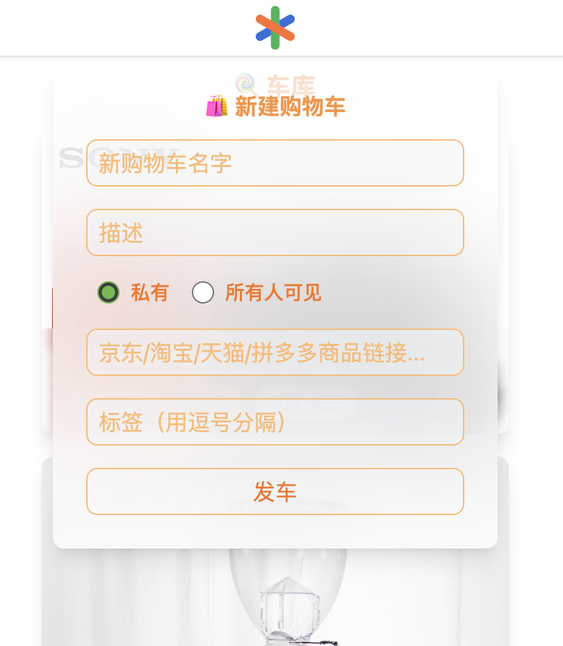

> 🎊 2022 年了，作为一个后端工程师，如何入坑前端，成为全干程师。 本文以做一个共享购物车的 Web 端为目标，从框架选型，配套工具链，编程语言语法，CSS 样式等等，涉及做一个前端项目的方方面面，啥都整一点，再次入坑前端，以主观视角总结一下。

## **框架及工具链选型**

其实我在几年之前也入坑过前端，用过 Angular 写过用于接口测试的工具，也因此被领导作为**幸运儿**选中，将已有的一个用 Delphi 写的金融后台管理系统搬到浏览器上。Angular 在前端三驾马车(React/Vue/Angular)里面好像一直不太受待见，作为已经弃坑的人，个人评价是 Angular 是为为框架区别于 React/Vue 的，选择了 Angular，也即绑定了相应的工具链，自由度也低很多，同时 Angular 也开箱即用的附带一套完整的工程实践，没有什么 Redux, Vuex 等等。这对新手快速入门写出可以上线的系统还是有好处的，坏处则是 `TOO HEAVY` 了，运行起来也能明显感觉到延迟，有很多现成的组件可以用，包括阴影爱好者 **Material UI** 也算是官方出品的，但是要自定义这些组件的逻辑或格式基本上就不可能了。

之前弃坑主要的原因是前端工具链太庞杂了，包括浏览器令人恐惧的适配问题，繁多的 JavaScript 版本(ES5, ES6, ESnext, ES2015...)；也整出了 Babel 这种将高版本 JS 语法代码编译成适配旧浏览器的低版本运行环时的编译器；用 polyfill 适配不同厂商的浏览器；而 Node.js 的包管理工具就有 npm, pnpm, yarn，配合 960 万平方公里的局域网，下载依赖等个半小时然后 **TIMEOUT** 也是时不时的事，顺便吐槽一下 Node.js 包的海量小文件简直是机械硬盘杀手；也有大佬 `Anders Hejlsberg` 发明了 TypeScript 来克服 JS 动态类型的安全问题和大型工程的开发效率问题；在 CSS 预处理器领域，也有诸如 LESS, Sass, Stylus 等工具；最后 JS 模块化也有 CommonJS 和 ESModule，视运行环境和 Node.js 版本决定那种方式可用或者混用。

此次重新入坑，主要是有了 [2022 年 JavaScript 开发工具的生态，别再用过时的框架了！](https://mp.weixin.qq.com/s?__biz=MzAxODE2MjM1MA==&mid=2651609107&idx=1&sn=1a9852c5b75c93a2cfe1cc75976fbc7e) 这篇文章作为参考，轻松选择了 React.js + Next.js + TailwindCSS + axios 等来构建应用。另一个参考的是 [Frontend Developer Roadmap](https://roadmap.sh/frontend)，用路线图的方式解构了前端开发的方方面面，对于前端知识框架的查漏补缺非常有帮助。

### **React.js**

上次学习 [React.js](https://reactjs.org/) 学到在 Class Component 里面写 `this.deleteRow.bind(this, id)` 这种代码的时候就被劝退了。React 16.8 引入 [Hooks](https://reactjs.org/docs/hooks-intro.html) 之后，算是消除了这个担忧 😟。

### **Next.js**

[Next.js](https://nextjs.org/docs/getting-started) 是构建在 React.js 上的前端开发框架，集成了编译器，CSS 预处理，路由等等，大大简化了前端工程化的问题，同时还引入了 SSR, SSG 等高级特性；使前端应用不再仅仅是运行在浏览器上面的单页面应用，也可以有对应的后端，最近来推出了号称比 `WebPack` 快 "**700倍**" 的 TurboPack。

### **TailwindCSS**

[Tailwind](https://tailwindui.com/) 提供一套标准的，风格一致的 CSS 样式集合，可以完全不写一行 CSS 代码，只通过 class 的组合实现的丰富的视觉样式；从有限的集合中选取可用的 `class name` 一方面可以保证风格一致，另一方面可以方便样式的管理，不至于像每个页面单独写一个 CSS 文件混乱分散，定义各种蹩脚的 class name；最后，TailwindCSS 配合 PostCSS 具，可以自动扫描项目中用到的 `class name` 输出一个用到的样式集合 CSS 文件，减少构建产物的体积，提高页面加载速度。

## **JavaScript & Node.js**

> 本节介绍一些项目中必须要理解又容易被忽略的基本概念，导致新手（指我🥺）在开发过程中很容易知其然，不知其所以然。

### **JavaScript Modules**

最初版本的 JavaScript 被设计成运行在浏览器中，通常是内嵌在 HTML 页面中的 `<script />` 代码，通过同步或异步的方式加载，并没有模块的概念，所有变量，常量，函数是全局可见的；这显然限制了前端的工程化。参考文档：[CommonJS vs. ES Modules: Modules and Imports in NodeJS](https://reflectoring.io/nodejs-modules-imports/) .

#### **CommonJS Modules**

在 `CommonJS Module` 模式下，每一个 `.js` 文件都是一个模块，通过 `module.exports` 导出文件中的 `symbol`，换言之，其它非导出的变量，常量，函数等，外部不可直接引用。

``` js
// file bar.js
const message = "Hello, world!"; // 模块外不可见
const greeting = () => {
    console.log(message);
}

module.exports = { greeting }; // 导出函数 bar
```

`module.exports` 可以简写成 `exports`，因此 `bar.js` 中的导出表达式也有对应的写法。

``` js
#1
exports.greeting = greeting;
#2
exports.hello = greeting; // 将 greeting 以 hello 我名字导出
#3
exports = {
    hello: greeting, // 与 #2 等价
}
```

通过 `require` 导入其它模块

``` js
// file foo.js
const bar = require("bar"); // 导入 bar.js 模块，模块名为去掉了后缀的文件名
bar.greeting();

const { greeting } = require("bar"); // 仅导入指定的 symbol
```

实际上可以将任意类型赋值给 `module.exports`，如 `class`

``` js
// file bar.js
class Logger {
    static debug(message) {
        console.log("DEBUG", message);
    }
}

module.exports = Logger;

// file foo.js
const Logger = require("./bar");
Logger.debug("hello, world!");
```

[`Node.js`](https://nodejs.org/) 默认支持 CommonJS Module，JavaScript ECMAScript(ES2015) 标准制定了标准的模块化规范 `ES Module`.

#### **ES Modules**

ES Module 也是以文件为单位作为模块，为了区别于 `.js` 文件默认作为 CommonJS Module, 规范定义 ES Module 文件的后缀名为 `.mjs`，实际实用一般仍用 `.js` 后缀，通过配置可自动识别文件使用的是那种 Module.

将前面的 Logger 改造成 ES Module 如下，

``` js
// bar.mjs
export default class Logger {
    static debug(message) {
        console.log("DEBUG", message);
    }
}

// 模块可以有一个 export default，但可以有多个其它 export 
export message = "Hello, world!";
export count = 42;

// 也可以集中导出
export { message, count };
```

通过 import 方式导入，

``` js
// foo.mjs
import Logger, { message, count } from "./bar";
Logger.debug("hello, world!");
Logger.debug(count);
Logger.debug(message);

// 当导入命名有冲突时，也可以重命名导入
import { default as BarLogger, message as defaultMessage, count} from "./bar";

// 导入成模块
import * as bar "./bar";
Logger.debug(bar.message);
```

#### **Dynamic vs. Static**

CommonJS 的 `requre()` 导入函数是在运行时动态解析导入的，也就是说 `require()` 可以像普通的函数那样使用，按需要导入，而 ES Module 的 `import` 是静态，在编译阶段就需要确定导入依赖，因些只能出现的文件头。

#### **index.js 与类型提示**

前面介绍的模块导入时，都是以文件名去掉后缀作为模块名，实际上也可以将文件夹名作为模块名（这可能也是为什么导入的时候不加文件名后缀的原因吧）

``` js
// 假设有文件夹 server 及其中的文件如下
// server
// ├── foo.js
// ├── bar.js
// ├── index.d.ts
// └── index.js
// 则将 index.js 作为 server 文件夹的默认模块导入如下
import * as server from "./server";
```

这种导入文件夹的方式有一个非常有用的地方在于可以在文夹中添加一个 index.d.ts 作为 index.js 中导出类型的定义 [Declartion Reference](https://www.typescriptlang.org/docs/handbook/declaration-files/by-example.html)，辅助 IDE（如：VSCode）进行类型提示，而又不必采用 `TypeScript`，作为 JavaScript 动态类型的补充。另一方面，也可以在非 index.js 文件中定义非导出类型，统一在 index.js 文件中导出，将文件夹整体作为一个模块，就像 `package.json` 中导入的依赖一样。

注意：CommonJS Module 中可以通过 import 命令被导入到 ES Module，反之则不行。

### **package.json**

`package.json` 是 Node.js 项目的配置文件，用来管理依赖，脚本，被作为库导入时的入口等。

#### **script**

`npm run` 命令运行的脚本，会自动创建一个 shell 脚本，并将当前项目目录下的 `node_modules/.bin` 子目录加入到 PATH 变量中，因此在 `scripts` 下可以直接调用 node_modules/bin 下的命令。

``` json
{
    "scripts": {
        "build": "esbuild index.js"
        // 等价于 "build": "./node_modules/.bin/esbuild index.js"
        // 使用 npm run build 触发
    }
}
```

#### **bin**

`bin` 指定了项目作为 npm 包的执行入口，当项目作为包被安装到全局或其它项目时，以命令的方式执行的入口脚本文件。如：@bytepack/cli 的 npm 包，

``` json
{
    "bin": {
        "bytepack": "./bin/index.js"
    }
}
```

全局安装 @bytepack/cli 包后，执行 `bytepack -v` 命令就相当于执行 `node ./bin/index.js -v` 命令。

#### **type**

`type` 指定项目的模块化规范

``` json
{
    "name": "some package",
    "type": "module" || "commonjs"
}
```

需要注意的是：

- 不指定type的时候，type 的默认值是 commonjs，不过建议 npm 包都指定一下 type
- 当 type 字段指定值为 module 则采用 ESModule 规范
- 当 type 字段指定时，目录下的所有 .js 后缀结尾的文件，都遵循 type 所指定的模块化规范
- 除了 type 可以指定模块化规范外，通过文件的后缀来指定文件所遵循的模块化规范，以 .mjs 结尾的文件就是使用的 ESModule 规范，以 .cjs 结尾的遵循的是 commonjs 规范

#### **expports**

如果在package.json中定义了exports字段，那么这个字段所定义的内容就是该npm包的真实和全部的导出，优先级会高于main和file等字段。

举例来说：

``` json
{
  "name": "pkg",
  "exports": {
    ".": "./main.mjs",
    "./foo": "./foo.js"
  }
}
```

``` js
import { something } from "pkg"; // from "pkg/main.mjs"
```

``` js
const { something } = require("pkg/foo"); // require("pkg/foo.js")
```

#### **peerDependenceis**

peerDependencies是package.json中的依赖项,可以解决核心库被下载多次，以及统一核心库版本的问题。

#### **package.json三方属性**

package.json中也存在很多三方属性，比如tsc中使用的types、构建工具中使用的sideEffects,git中使用的husky，eslint使用的eslintIgnore，这些扩展的配置，针对特定的开发工具是有意义的这里不一一举例。

更多配置参考：[package.json 配置介绍](https://mp.weixin.qq.com/s/91uQb5NKpINgdTEF9L0eMQ).

### **Local Storage vs. Session Storage vs. Cookie**

简单介绍浏览器端的存储的选择，所有的存储都是范围都是限定域名下面的，即：`a.com` 域名的存储不能被 `b.com` 域名的代码读取到。参考文档：[Local Storage vs Session Storage vs Cookie](https://www.xenonstack.com/insights/local-vs-session-storage-vs-cookie).

#### **Local Storage**

Local Storage 中存储的内容是持久的，关闭页面或浏览器不会清除其中的内容，通过 JavaScript 代码进行操作。

``` js
localStorage.setItem(key, value);
localStorage.getItem(key);
localStorage.removeItem(key);
localStorage.clear();
```

Key 和 Value 均为字符串类型，因此存储前需要先将数据序列化，最多大概可存储 10MB。

#### **Session Storage**

Session Storage 与 Local Storage 类似，唯一的不同在于它生命周期比较短，当浏览器 Tab 页关闭时，Session Storage 中的内容清除，最多大概可存储 5MB。

``` js
sessionStorage.setItem(key, value);
sessionStorage.getItem(key);
```

Session Storage 一般用不到，除非用来做页面级别的控制。

#### **Cookie**

Cookie 存储的一般是形如 `a=foo;b=bar;token=xxx` 的表单数据，当用户点击链接或浏览器自动跳转时请求后端服务器时，浏览器会自动在请求头中带上域名对应的 Cookie 内容而不需要任何 Cliet-Side JavaScript 做操作，相比 Local/Session Storage 方便，当然每个请求都携带 Cookie 不可避免地造成带宽浪费。

Cookie 内容可以由后端服务在返回请求头中设置，如用户登录 `a.com` 域名后，服务端的响应 Header 中包含 `Set-Cookie: token=xxx`，浏览器接收到响应后就会自动设置 Cookie 而不需要 JavaScript 代码操作；同时，为了防止恶意代码获取第三方 Cookie，可以在响应头中增加 `HttpOnly` 来防止 JavaScript 代码读取 Cookie 内容，如：`Set-Cookie: token=xxx;HttpOnly`，由浏览器实现保证安全性，也可以设置失效时间，过期内容自动销毁。

Cookie 的缺点，第三方 Cookie 可能被盗用，存储最多 4KB 数据，只存储于浏览器，在小程序等环境只有没有 Cookie。

更多选项：

``` plain
Set-Cookie: <name>=<value>[; <Max-Age>=<age>]
[; expires=<date>][; domain=<domain_name>]
[; path=<some_path>][; secure][; HttpOnly]
```

### **工具链选择**

#### **包管理工具 pnpm**

pnpm 比 npm 更节省磁盘空间，yarn 开始被抛弃，相关环境变量, [npm vs yarn vs pnpm commands cheatsheet](https://dev.to/equiman/npm-vs-yarn-vs-pnpm-commands-cheatsheet-3el8).

``` bash
export PNPM_HOME=$DEVKIT/.pnpm
export PATH=$PATH:$PNPM_HOME
```

#### **编译工具 swc**

swc: [Speedy Web Compiler](https://swc.rs/)，用 Rust 开发的极快的 JS/TS 编译器，需要 tsc 补充静态类型检查，支持 Next.js, Vercel, Deno 的组件，具备一定的打包能力，Next.js 直接集成了 swc，无需配置。官方介绍：
`SWC can be used for both compilation and bundling. For compilation, it takes JavaScript / TypeScript files using modern JavaScript features and outputs valid code that is supported by all major browsers.`

> **SWC is 20x faster than Babel on a single thread and 70x faster on four cores.**

#### **打包工具 WebPack**

打包器负责将所有的源文件打包到一起，用于打包第三方库和 Web 应用：

- swc 和 esbuild 提供了基本的打包能力，但与打包器相比功能不全面
- Rollup 只支持第三方库打包，Parcel 只支持 swc 编译器
- **WebPack** 支持 Web 应用和第三方库打包，支持 swc, tsc

#### **VSCode 插件**

- **VSCode React Refactor**
- **ESLint**
- **Prettier ESLint**
- **Code Spell Checker**
- **ES7+ React/Redux/React-Native snippets**
- **Tailwind CSS Intellisense**
- **Emmet**
- **Prettier**
- **Auto rename tag**

小结：看完前端的铺垫如果还健在的话，那么我们就可以动手创建创建一个 Next.js 工程开始整一个 Web 端共享购物车项目了。

### **React.js & Next.js**

首先用 pnpm 创建一个 Next.js 工程，语言方面，不启用 TypeScript，我们只需要 `index.d.ts` 类型声明来辅助 IDE 做代码提示就够了，一方面，网上的示例代码绝大多数是 JavaScript，另一方面，TypeScript 对于初学者来说收益相对于付出的学习成本不匹配。

``` bash
pnpm create next-app
```

选择了 Next.js，也就选择了 swc, WebPack 等，同时也可时无缝集成 [TailwindCSS](https://tailwindcss.com/docs/guides/nextjs).

参考文档：[Create Next App](https://nextjs.org/docs/api-reference/create-next-app).

Next.js 官方提供了非常友好的文档，可以直接参考，[Getting Start](https://nextjs.org/docs/getting-started)。

#### **服务端渲染 SSR**

传统的 Web App (Angular/React/Vue) 是将项目打包成 JS/CSS/HTML 等等静态资源，放到静态资源服务器中供浏览器请求，用户在浏览器端访问 Web App 时先请求 HTML/CSS/JS 等静太资源，浏览器获取到静态资源后，再运行 JS 代码访问后端接口获取动态的数据（如：用户个人数据等）最终渲染成页面呈现给用户。

Next.js 在传统 Web App 的基础上提供了 Server-Side Rendering(SSR)，即 Next.js 应用是作为后端服务器运行的，用户请求页面时，Next.js 后端应用可以先运行 JS 代码，渲染成 HTML/CSS 直接返回给客户端，客户端浏览器获得响应后即可直接呈现给用户，不用二次请求。更多关于 SSR 的优缺点点可以参考：[getServerSideProps](https://nextjs.org/docs/basic-features/data-fetching/get-server-side-props).

#### **静态网站生成 SSG**

Static Site Generation(SSG) 进一步地将页面生成前置到编译阶段，允许用户定义 `getStaticProps()` 函数，在编译的时候运行得到与页面渲染相关的数据，从而改变编译生成页面，对于搜索引擎索引比较有用，参考：[getStaticProps](https://nextjs.org/docs/basic-features/data-fetching/get-static-props).

#### **Next.js 项目结构**

``` bash
my-app
├── next.config.js    # 项目配置文件
├── node_modules
├── package.json
├── components        # 可以复用 React 组件
├── lib               # 项目内 JavaScript 库，如封装调用后端的接口
├── pages             # pages 每个非下划线开头的文件对应一个页面或 API，目录结构与浏览器地址路径对应
│   ├── api
│   │   └── hello.js  # 后端 api，可以通过 /api/hello 访问到 hello.js 中的函数
│   ├── _app.js       # 所有的页面都会通过这个渲染，可以在这里加项目全局的代码，如：登录检查，夜间模式
│   └── index.js      # 应用的主页面，即访问 http://localhost:3000 看到的页面
├── pnpm-lock.yaml
├── public
│   ├── favicon.ico
│   └── vercel.svg
├── README.md
└── styles
    ├── globals.css   # 全局 CSS 影响所有组件，TailwindCSS 在这个文件中导入样式
    └── Home.module.css # 被 /pages/index.js 导入
```

关于 Next.js 的路由，可以参考：[Routing](https://nextjs.org/docs/routing/introduction).

#### **上下文菜单**

在浏览器，实现上下文菜单并不是很直观，实际上只是模拟传 UI 的上下文菜单的操作。基本的 HTML 元素渲染都是顺序铺开的，而上下文菜单，需要显示的时候覆盖在现有的元素之上，同时点击菜单外的区域隐藏菜单。因此，需要用到 CSS 中的 `position: absolute` 来设置元素的位置为绝对，同时辅助 `left, right, top, bottom` 来指定元素的位置，上下左右的参考坐标为元素的最近一个 `position: relative` 元素。示例如下：

``` js
import React from "react";

function CreatedBy({ cart, onAction }) {
  const [toggle, setToggle] = React.useState(false);
  const onToggle = () => {
    setToggle(toggle => !toggle);
  };
  return (
    <div className="inline-block">
      <span onClick={onToggle}
        className={`relative cursor-pointer bg-gray-300 rounded-full px-3 py-1 m-1 whitespace-nowrap text-sm font-semibold 
        ${toggle && "before:z-40 before:fixed before:block before:cursor-default before:top-0 before:left-0 before:bottom-0 before:right-0"}`}>
        by ME
      </span>
      <div className={`absolute z-50 ${toggle ? "block" : "hidden"}`}>
        <div className="flex flex-col w-fit py-2 shadow-lg rounded-lg mb-2 bg-gray-100 bg-opacity-95">
        <span className="inline-block cursor-pointer px-6 py-2 hover:bg-gray-200 text-sm font-semibold text-green-700"
            onClick={onToggle}>
            邀请
        </span>
        <span className="inline-block cursor-pointer px-6 py-2 hover:bg-gray-200 text-sm font-semibold text-red-500"
            onClick={onToggle}>
            删除
        </span>
        </div>
      </div>
    </div>
  );
}

export default CreatedBy;
```

- 使用 React Hook `React.useState(false)` 来管理菜单的显示(true)与隐藏(false)
- 使用伪元素创建一个覆盖整个页面的区域用来接收隐藏菜单事件 before:z-40 before:fixed before:block before:cursor-default before:top-0 before:left-0 before:bottom-0 before:right-0
- 通过修改 div 的 display 属性为 block/none(hidden) 来控制上下文菜单的显示 `className={`absolute z-50 ${toggle ? "block " : "hidden"}`}`


#### **全局上下文菜单**

CartCart 共享购物车在导航栏的中间有一个 Logo 作为全局按钮，导航栏在 Web App 的任意页面都可见，我们需要在不同页面按这个按钮都根据当前页面来显示不同的上下文菜单（如在购物车列表页面出现新建购物画菜单，在商品列表页面出现添加商品菜单），或者直在点击按钮的时候跳转页面。最终效果如下：





这个功能可以利用 React 的 [Context](https://reactjs.org/docs/context.html) 功能来实现。

首先定义 Context Provider 即这个全局按钮，我们需要在不同页面感知到这个按钮被点击了，同时我们在不同页面操作完成之后，需要回调告诉 Context Provider。

``` js
import Image from "next/image";
import React from "react";

function Carter() {
  const { toggle, setToggle } = useCarter();
  return (
    <>
      <div onClick={() => { setToggle(toggle => !toggle); }}>
        <div className={(toggle ? "before:z-40 before:fixed before:block before:top-0 before:left-0 before:bottom-0 before:right-0 " : "")} />
        <div className={"cursor-pointer w-8 h-8 transition-transform " + (toggle ? "rotate-45" : "")}>
          <Image width="32" height="32" alt="CartCart" src="/cartcart.svg" priority={true} ></Image>
        </div>
      </div>
    </>
  );
}

const CarterContext = React.createContext(null);

function CarterProvider(props) {
  const [toggle, setToggle] = React.useState(false);
  return (
    <CarterContext.Provider value={{ toggle, setToggle }} {...props} />
  );
}

function CarterPopup({ toggle, children }) {
  return (
    <div className={"max-w-sm fixed z-50 left-1/2 -translate-x-1/2 top-12 " + (toggle ? "block" : "hidden")}>
      {children}
    </div>
  );
}

const useCarter = () => React.useContext(CarterContext);

export default Carter;
export { CarterProvider, CarterPopup, useCarter };
```

将 Context 注入到 `_app.js` 上下文中，前面提到所有的页面都会通过这个文件的函数渲染。

``` js
function CartCartApp({ Component, pageProps }) {
  return (
    <>
      <Head>
        <title>CartCart</title>
      </Head>
      <div className="flex flex-col items-center" >
          <CarterProvider>
            <NavBar />
            <Component {...pageProps} />
          </CarterProvider>
      </div>
    </>
  );
}

export default CartCartApp;
```

在不同页面中通过 useCarter 监听全局按钮的点击事件。

``` js

const CartPage = () => {
  const { toggle, setToggle } = useCarter();
  return (
    <>
      {
        toggle &&
        <CarterPopup toggle={toggle}>
          {全局上下文菜单内容}
        </CarterPopup>
      }
    </>
  );
};
```

#### **页面延迟更新**

在页面需要从后端动态加载数据进行渲染或定时刷新时，需要用到 `React.useEffect()` Hook 函数。单纯用 async 函数或 `setInterval()` 等函数是无法在 React Functional Component 中触发组件更新的。

如下路由到商品列表页时，调用后台 API 加载商品数据的步骤需要放到钩子函数中，第二个参数是依赖列表，当依赖的对象发生变化(Object Identity)时 React 都会执行传入的第一个函数更新组件。

``` js
const CartPage = () => {
  const [cart, setCart] = React.useState(null);
  const router = useRouter();
  useEffect(() => {
    if (!router.isReady) { return; }
    server.getCart(router.query.cid).then(cart => setCart(cart));
  }, [router]);


  if (!cart) {
    return <div className="w-fit mt-12"><Loading width={64} height={64} /></div>;
  }

  return (
    <div>
      {cart.items?.map(item => <Item key={item.id} item={item} />)}
    </div>
  );
};
```

或者页面倒计时，在 `React.useEffect()` 第一个参数的函数中，可以返回一个回调函数，用作 clean up.

``` js

const Home = () => {
  const [countdown, setCountdown] = React.useState(60);

  React.useEffect(() => {
    let countdownInterval = setInterval(() => {
      if (countdown > 0) {
        setCountdown(countdown => countdown - 1);
      } else {
        setCountdown(null);
      }
    }, 1000);
    return () => { clearInterval(countdownInterval); };
  }, [countdown]);

  return (
    <div>
        {countdown ? countdown + "s" :  "done" }
    </div>
};
```

## **应用展示**

撑握了上面的基础知识加上一些细节之后，我们就可以做一个 Web 端的共享购物车应用了。

